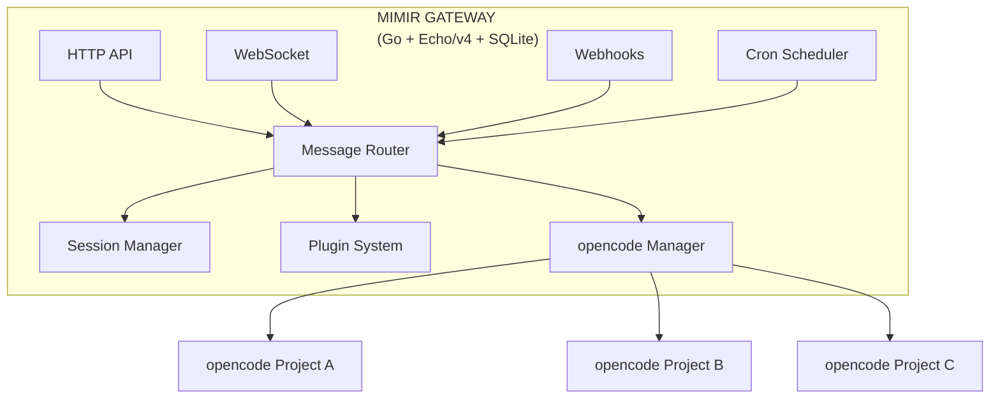
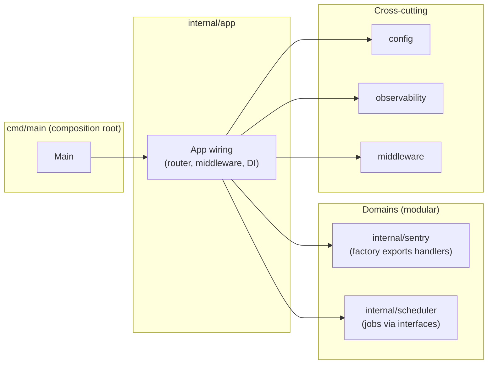
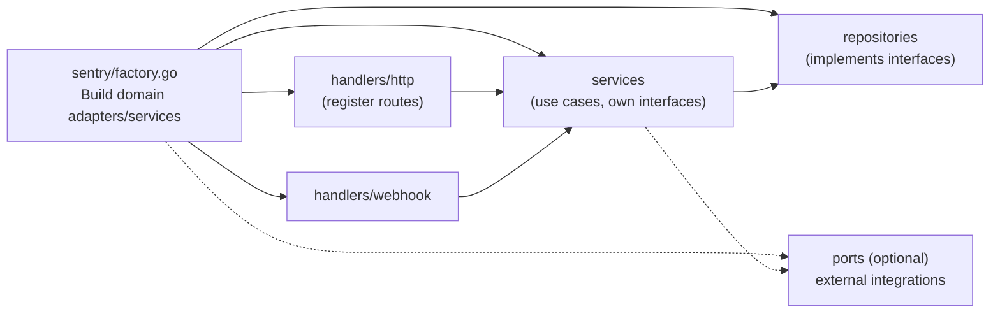
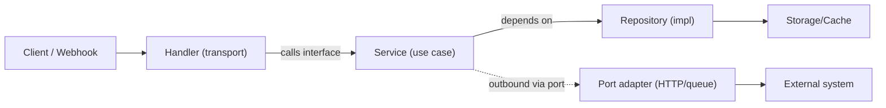
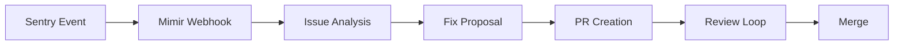

# Mimir

Mimir is a personal AI assistant and orchestrator for managing multiple [opencode](https://github.com/anomalyco/opencode) instances across different projects, contexts, and use cases (professional, personal).

## Vision

- **Auto-trigger workflows**: Cron jobs for routine tasks, webhooks for external events
- **Self-improvement**: Review code, suggest improvements, learn from feedback
- **Full lifecycle automation**: From issue detection → analysis → fix → PR → review → merge

## Inspiration

- [kimaki](https://github.com/remorses/kimaki) - Discord-based control of opencode agents
- [clawdis](https://github.com/steipete/clawdis) - Personal AI assistant with gateway architecture

---

## Architecture

### Tech Stack

| Component | Technology | Rationale |
|-----------|------------|-----------|
| **Gateway** | Go + Echo/v4 | Daily driver, performant, simple |
| **Agent Runtime** | opencode (server mode) | Mature, active community, heavy development |
| **Database** | SQLite (encrypted) | Simple, portable, secure data at rest |
| **Protocols** | WebSocket + HTTP REST | WS for chat/web, REST for testing/debug/maintenance |

### High-Level Design



### Gateway file structure

Organized for domain-first separation, interface-driven contracts, and cross-cutting concerns.

Key directories:
- `cmd/` — CLI and entrypoints.
- `internal/` — Application code (not importable by downstream binaries).
  - `app/` — Composition root: wiring routers, middleware, DI/container, lifecycle.
  - `config/` — Config loading, validation, defaults.
  - `observability/` — Logging, tracing, metrics setup.
  - `middleware/` — HTTP/WS middleware (auth, rate limiting, recovery, request ID).
  - Domain packages (one per business capability):
    - `sentry/` (example)
      - `handlers/http`, `handlers/webhook`, `handlers/grpc` — Transport adapters; thin, stateless.
      - `services/` — Use cases; depend on interfaces, not concrete repos.
      - `models/` — DTOs and domain models; version external-facing DTOs when needed.
      - `repositories/` — Implement persistence/cache; satisfy service-defined interfaces.
      - `ports/` (optional) — Shared interfaces for inbound/outbound adapters to enforce contracts.
      - `factory.go` (or `factory/`) — Domain-owned handler/service wiring; exposed to `cmd/main` to plug/unplug the domain without leaking internals.
  - `scheduler/` — Cron jobs/routines orchestrated via interfaces.
  - `testutil/` — Shared test helpers/fixtures/mocks.
- `pkg/` — Reusable, dependency-light utilities safe for external import (avoid business logic).
- `scripts/` — Dev tooling (lint, fmt, generate, migrate).
- `deploy/` or `infra/` — Ops artifacts (manifests, Terraform, K8s, Docker).
- `internal/gen/` — Generated code and codegen configs (`tools.go`, Makefile/magefile).

Interface-first guidance:
- Define interfaces at the consumer boundary (e.g., services own repository interfaces) to keep dependency direction inward and prevent contract breakage.
- Handlers depend on service interfaces; repositories implement interfaces; outbound integrations (HTTP, queue, webhook) sit behind ports.
- Each domain exposes a factory (wiring function) for its handlers/services; `cmd/main` composes domains, enabling a modular monolith you can plug/unplug.
- Forbid direct cross-domain calls; use explicit channels (pub/sub, queues, or domain ports) to decouple services and allow multiple gateway instances without conflict.
---

### Architecture diagrams (mermaid)

**High level (gateway composition)**



**Medium level (domain wiring via factory)**



**Low level (request/command flow, interface-first, no cross-domain calls)**



### Example wiring (Go)

`cmd/main.go` (composition root) plugs domains via factories:

```go
package main

import (
    "context"
    "log"

    "github.com/labstack/echo/v4"

    "mimir/internal/app"
    "mimir/internal/config"
    sentrydom "mimir/internal/sentry"
    schedulerdom "mimir/internal/scheduler"
)

func main() {
    ctx := context.Background()

    cfg, err := config.Load()
    if err != nil {
        log.Fatalf("load config: %v", err)
    }

    e := echo.New()
    container := app.NewContainer(cfg) // holds shared deps (db, cache, logger, metrics)

    // Compose domains via factories (plug/unplug)
    if cfg.Features.SentryEnabled {
        sentryFactory := sentrydom.NewFactory(container) // heavy wiring stays inside domain
        sentryFactory.RegisterHTTP(e.Group("/sentry"))
        sentryFactory.RegisterWebhook(e.Group("/webhooks/sentry"))
    }
    if cfg.Features.SchedulerEnabled {
        schedulerFactory := schedulerdom.NewFactory(container)
        schedulerFactory.RegisterJobs(ctx) // e.g., starts cron jobs via interfaces
    }

    // Start server
    if err := e.Start(cfg.Server.Addr); err != nil {
        log.Fatal(err)
    }

    // Optional: graceful shutdown logic with context cancel
    _ = ctx
}
```

`internal/config/config.go` (feature toggles as flags):

```go
package config

type Features struct {
    SentryEnabled    bool `env:"FEATURE_SENTRY_ENABLED" default:"true"`
    SchedulerEnabled bool `env:"FEATURE_SCHEDULER_ENABLED" default:"true"`
    // add other domain toggles here
}

type Config struct {
    Server struct {
        Addr string `env:"SERVER_ADDR" default:":8080"`
    }
    Features Features
}

func Load() (Config, error) {
    // hydrate from env/file; validate; return
}
```

Key interfaces (owned at consumer boundaries):

```go
// internal/sentry/services.go
type IssueService interface {
    Create(ctx context.Context, dto CreateIssueDTO) (Issue, error)
    Get(ctx context.Context, id string) (Issue, error)
}

// internal/sentry/repositories.go (interfaces live with the consumer services)
type IssueRepo interface {
    Save(ctx context.Context, issue Issue) error
    FindByID(ctx context.Context, id string) (Issue, error)
}

// internal/sentry/ports.go (optional outbound ports)
type IncidentNotifier interface {
    Notify(ctx context.Context, evt IncidentEvent) error
}

// internal/app/container.go (shared deps exposed as interfaces)
type DB interface {
    Exec(ctx context.Context, query string, args ...any) error
    Query(ctx context.Context, dest any, query string, args ...any) error
}

type Logger interface {
    Infof(msg string, args ...any)
    Errorf(msg string, args ...any)
}

type Metrics interface {
    Counter(name string, tags ...string) func(delta float64)
    Histogram(name string, tags ...string) func(value float64)
}
```

`internal/sentry/factory.go` (domain-owned wiring, no leakage):

```go
package sentry

import (
    "github.com/labstack/echo/v4"
)

type Container interface {
    DB() DB
    Logger() Logger
    Metrics() Metrics
    // add other shared deps via interfaces only
}

type Factory struct {
    svc    IssueService
    httpH  *HTTPHandler
    hookH  *WebhookHandler
}

func NewFactory(c Container) *Factory {
    repo := NewIssueRepo(c.DB(), c.Logger())
    svc := NewIssueService(repo, c.Logger(), c.Metrics())
    return &Factory{
        svc:   svc,
        httpH: NewHTTPHandler(svc),
        hookH: NewWebhookHandler(svc),
    }
}

// RegisterHTTP registers domain HTTP routes.
func (f *Factory) RegisterHTTP(g *echo.Group) {
    g.POST("/issues", f.httpH.CreateIssue)
    g.GET("/issues/:id", f.httpH.GetIssue)
}

// RegisterWebhook registers webhook endpoints (still transport layer).
func (f *Factory) RegisterWebhook(g *echo.Group) {
    g.POST("/event", f.hookH.HandleEvent)
}
```

Notes:
- Handlers depend only on service interfaces; services own the repo interfaces.
- Cross-domain calls are not allowed; use events/ports if domains need to communicate.
- Swap repos or outbound adapters by providing different implementations to the factory.

## MVP Scope

### Primary Use Case: Sentry Integration

Mimir listens to Sentry events and orchestrates the full issue resolution lifecycle:



**Workflow Steps:**
1. **Receive** Sentry webhook (error spike, new issue, etc.)
2. **Analyze** the issue using opencode against the relevant project
3. **Propose** a fix with explanation
4. **Create** a PR with the fix
5. **Iterate** based on feedback from maintainers/other agents
6. **Complete** when PR is approved/merged or issue is resolved

### MVP Checklist

#### Core Gateway
- [ ] HTTP server (Echo/v4)
- [ ] WebSocket server for real-time communication
- [ ] SQLite database setup (with encryption support)
- [ ] Configuration loader (`~/.mimir/config.yaml`)
- [ ] Health check endpoint (`GET /health`)

#### Session & State Management
- [ ] Session CRUD (create, get, list, delete)
- [ ] Conversation history storage
- [ ] Project registry (which opencode instances exist)

#### opencode Integration
- [ ] opencode server mode client
- [ ] Multi-instance management (spawn, connect, disconnect)
- [ ] Message routing to correct opencode instance
- [ ] Response streaming back to caller

#### Webhook System
- [ ] Generic webhook endpoint (`POST /webhooks/:source`)
- [ ] Sentry webhook handler
- [ ] Webhook payload validation
- [ ] Event-to-action mapping

#### Cron/Scheduler
- [ ] Basic cron scheduler
- [ ] Job definition (what to run, when, on which project)
- [ ] Job history/logs

#### CLI Interface
- [ ] `mimir serve` - Start the gateway
- [ ] `mimir status` - Show gateway status
- [ ] `mimir projects list` - List registered projects
- [ ] `mimir projects add <path>` - Register a project
- [ ] `mimir send --project <name> --message "..."` - Send message to opencode

#### Plugin System (Basic)
- [ ] Plugin interface definition
- [ ] Plugin loader
- [ ] Sentry plugin (first implementation)

#### Observability (Minimal for MVP)
- [ ] Structured logging (JSON)
- [ ] Request/response logging
- [ ] Basic metrics endpoint (`GET /metrics`)

---

## Post-MVP Roadmap

- [ ] Web UI for monitoring and interaction
- [ ] Discord/Slack integration
- [ ] GitHub App for PR automation
- [ ] Multi-tenant support
- [ ] Advanced plugin marketplace
- [ ] Voice interface
- [ ] Self-improvement loops (learn from successful fixes)

---

## Configuration

```yaml
# ~/.mimir/config.yaml
server:
  http_port: 8080
  ws_port: 8081

database:
  path: ~/.mimir/mimir.db
  # Prefer runtime-provided key (prompt or injected env var). Avoid hardcoding.
  encryption_key: ${MIMIR_DB_KEY}

opencode:
  default_model: anthropic/claude-sonnet-4-20250514

projects:
  - name: my-api
    path: /path/to/my-api
    opencode_port: 9001
  - name: my-frontend
    path: /path/to/my-frontend
    opencode_port: 9002

webhooks:
  sentry:
    secret: ${SENTRY_WEBHOOK_SECRET}
    projects:
      - sentry_project: my-api-prod
        mimir_project: my-api

cron:
  - name: daily-code-review
    schedule: "0 9 * * *"
    project: my-api
    action: review
```

---

### Security Notes (secrets)
- Do **not** commit secrets. Prefer runtime prompt: if `MIMIR_DB_KEY` is absent, the gateway should prompt on boot and keep it only in memory.
- When non-interactive (containers/CI), inject via env var (`MIMIR_DB_KEY`) or secret manager; fail fast if missing.
- Consider supporting OS keychain or age/GPG-wrapped config for at-rest storage of the key if needed.

### Auto-setup for new projects
- Provide `mimir init` wizard to detect project type (Go/Node/Python), suggest opencode port, and generate/update `~/.mimir/config.yaml`.
- Validate connectivity to opencode server mode (ping) and auto-start if configured.
- Verify prerequisites (git present, repo clean or warn), and create an example cron/job entry.
- Re-run the wizard safely when setup changes: keep idempotent updates (append/merge projects), back up prior config, and diff changes before write.

---

## Getting Started

```bash
# Install
go install github.com/taultek/mimir@latest

# Initialize config
mimir init

# Register a project
mimir projects add ./my-project

# Start the gateway
mimir serve

# In another terminal, send a message
mimir send --project my-project --message "Review the authentication module"
```

---

## License

TBD