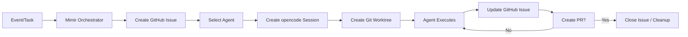
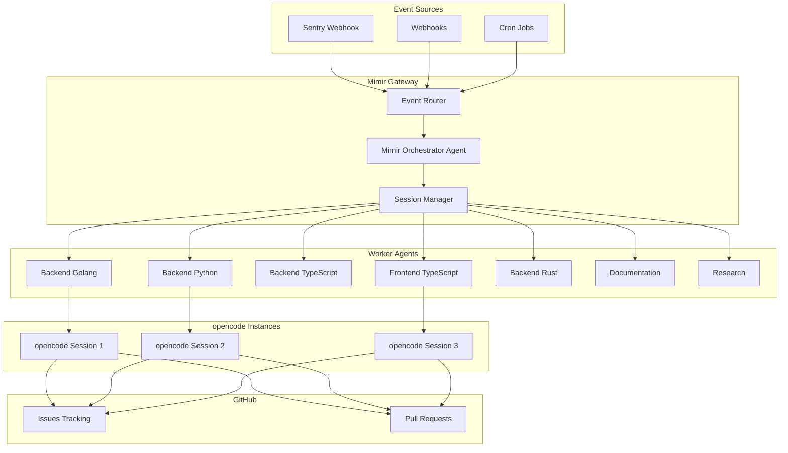

# Mimir AGENTS Documentation

Complete guide to the AGENTS system in Mimir - orchestrating multiple opencode instances for autonomous software development.

## Quick Start

1. **Understand the architecture** → [Agents Overview](./agents-overview.md)
2. **Learn how orchestration works** → [Agent Orchestration](./agents-orchestration.md)
3. **See how agents discover and route tasks** → [Agent Discovery](./agents-discovery.md)
4. **Explore workflow patterns** → [Agent Workflows](./agents-workflow.md)
5. **Understand isolation** → [Git Isolation](./agents-isolation.md)
6. **Track work via GitHub** → [GitHub Integration](./agents-github-integration.md)
7. **Create custom agents** → [Agent Development](./agents-development.md)

## Key Concepts

### What are AGENTS?

Agents in Mimir are specialized workers that can trigger other agents to complete complex tasks. They are:
- **Ephemeral**: Created for specific tasks, tracking work via GitHub issues
- **Language/stack-specific**: Backend (Go, Python, TypeScript), Frontend (TypeScript), General purpose
- **Orchestrated by Mimir**: The Mimir agent manages workflows, event routing, and agent coordination
- **Isolated**: Each agent works in its own git worktree to avoid conflicts

### Agent Types

- **Orchestrator Agent**: Manages workflows, spawns workers, coordinates handoffs
- **Worker Agents**: Specialized by language/stack (backend-golang, frontend-typescript, etc.)
- **Domain Agents**: Sentry-triage, documentation, research, code-review

### Architecture Highlights

- **Hybrid Approach**: Centralized agent registry + project-specific overrides in `.opencode/agent/*.md`
- **Dynamic Discovery**: Analyze project type to select appropriate agent automatically
- **100% opencode Compatible**: All agent definitions follow opencode's `.opencode/agent/*.md` structure
- **GitHub Issue Tracking**: One issue per task for monitoring and multiplayer collaboration
- **Git Worktree Isolation**: Automatic worktree creation per agent session

## Documentation Structure

### Core Documentation
- [Agents Overview](./agents-overview.md) - System architecture and design principles
- [Agent Orchestration](./agents-orchestration.md) - Mimir orchestrator and session management
- [Agent Discovery](./agents-discovery.md) - Dynamic agent analysis and routing
- [Agent Workflows](./agents-workflow.md) - Multi-agent workflow patterns
- [Git Isolation](./agents-isolation.md) - Worktree-based agent isolation
- [GitHub Integration](./agents-github-integration.md) - Issue tracking workflow
- [Agent Development](./agents-development.md) - Creating custom agents

### Examples
- [Sentry Workflow](./agents-examples/sentry-workflow.md) - Complete Sentry integration example
- [Multi-Agent Task](./agents-examples/multi-agent-task.md) - Task requiring multiple agents

### Agent Registry
Production-ready agent definitions following opencode structure:

- [Mimir Orchestrator](./agents-examples/registry/mimir-orchestrator.md)
- [Sentry Triage Agent](./agents-examples/registry/sentry-triage-agent.md)
- [Backend Golang Agent](./agents-examples/registry/backend-golang-agent.md)
- [Backend Python Agent](./agents-examples/registry/backend-python-agent.md)
- [Backend TypeScript Agent](./agents-examples/registry/backend-typescript-agent.md)
- [Frontend TypeScript Agent](./agents-examples/registry/frontend-typescript-agent.md)
- [Backend Rust Agent](./agents-examples/registry/backend-rust-agent.md)
- [Documentation Agent](./agents-examples/registry/documentation-agent.md)
- [Research Agent](./agents-examples/registry/research-agent.md)

## Quick Reference

### Agent Lifecycle



### Key Commands

```bash
# List available agents
mimir agents list

# View agent details
mimir agents show backend-golang

# Monitor active agent sessions
mimir agents sessions

# View agent's GitHub issues
gh issue list --label mimir
```

## Getting Started Checklist

- [ ] Read [Agents Overview](./agents-overview.md) to understand the system
- [ ] Review [Agent Orchestration](./agents-orchestration.md) for session management
- [ ] Study the [Sentry Workflow Example](./agents-examples/sentry-workflow.md)
- [ ] Explore agent definitions in the [registry](./agents-examples/registry/)
- [ ] Set up GitHub integration for issue tracking
- [ ] Configure git worktree isolation
- [ ] Deploy your first multi-agent workflow

## Architecture Diagram



## FAQ

### How do agents communicate?
Agents communicate via the Mimir orchestrator using opencode sessions and GitHub issues for tracking.

### Can multiple agents work on the same codebase?
Yes, each agent works in its own git worktree for isolation. Changes are coordinated via PRs.

### How are agents selected for a task?
Dynamic analysis of the project determines the appropriate agent type (language, stack).

### Where are agent definitions stored?
Hybrid approach: Centralized registry in `/docs/agents-examples/registry/` + project-specific overrides in `.opencode/agent/*.md`.

### How do I monitor agent progress?
Track via GitHub issues labeled with `mimir`. Each issue contains progress updates from the agent.

### Can I create custom agents?
Yes, follow opencode's agent definition format in `.opencode/agent/*.md`. See [Agent Development](./agents-development.md).

---

**For detailed implementation guidance, see the individual documentation sections linked above.**
