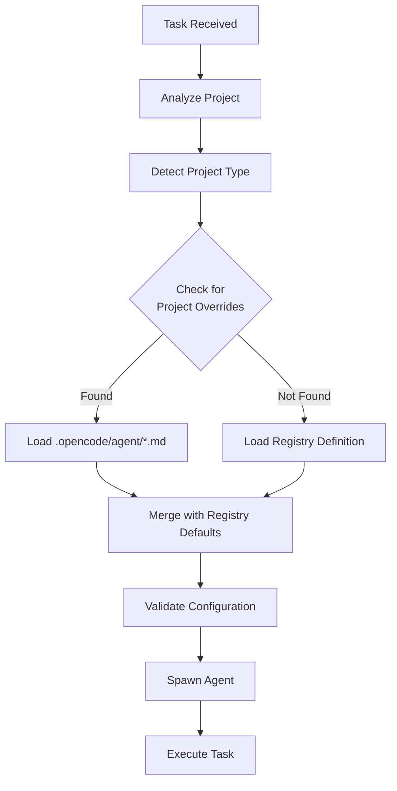
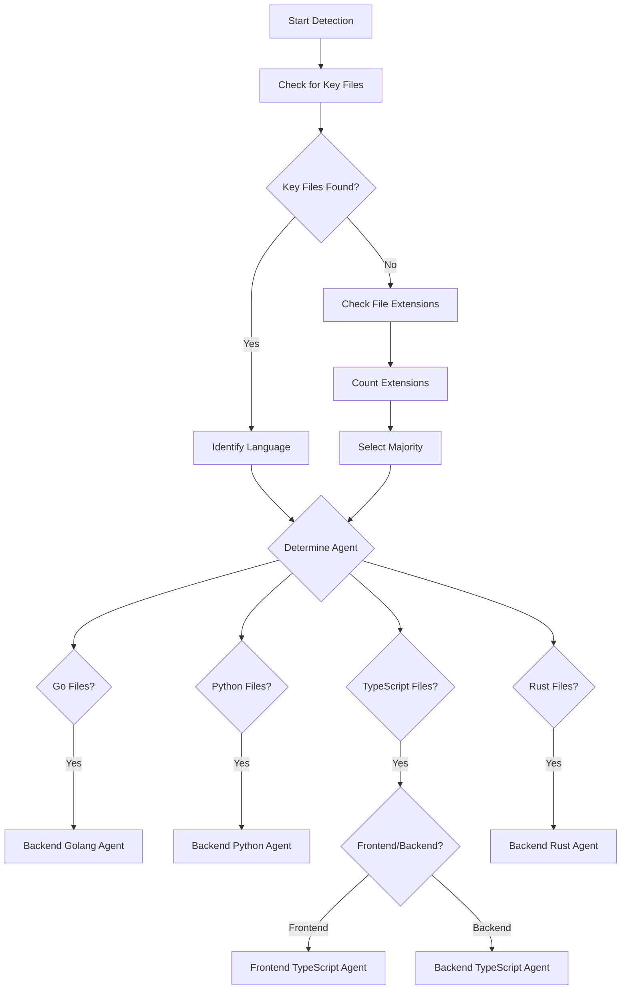
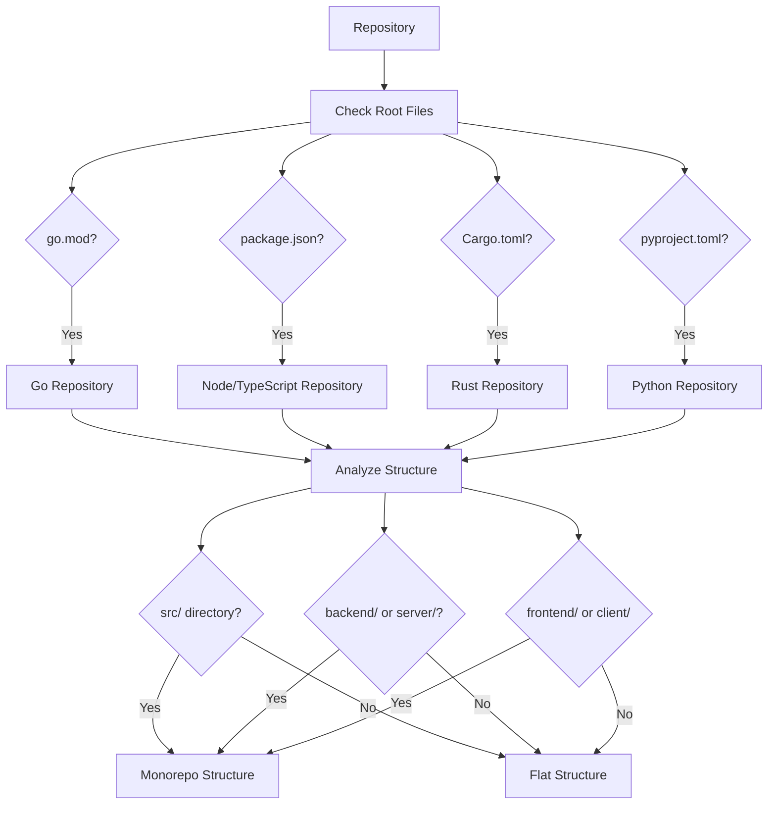
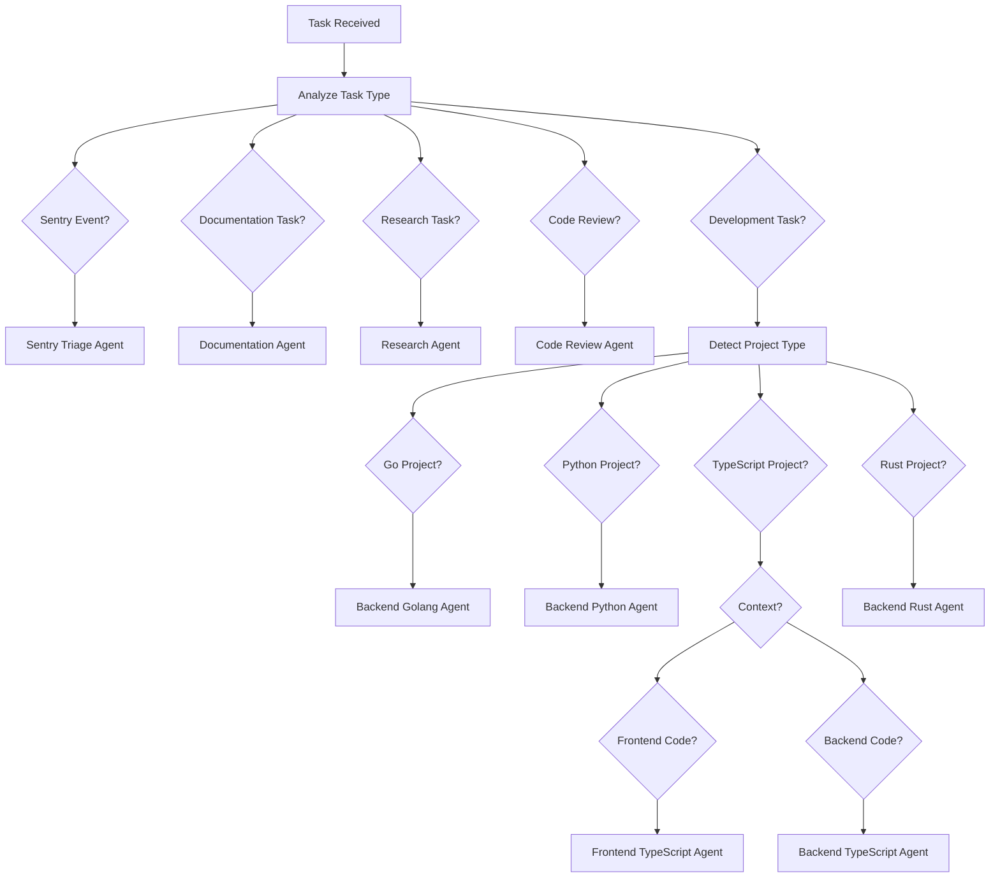
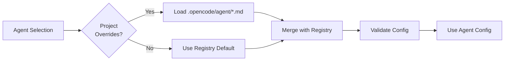
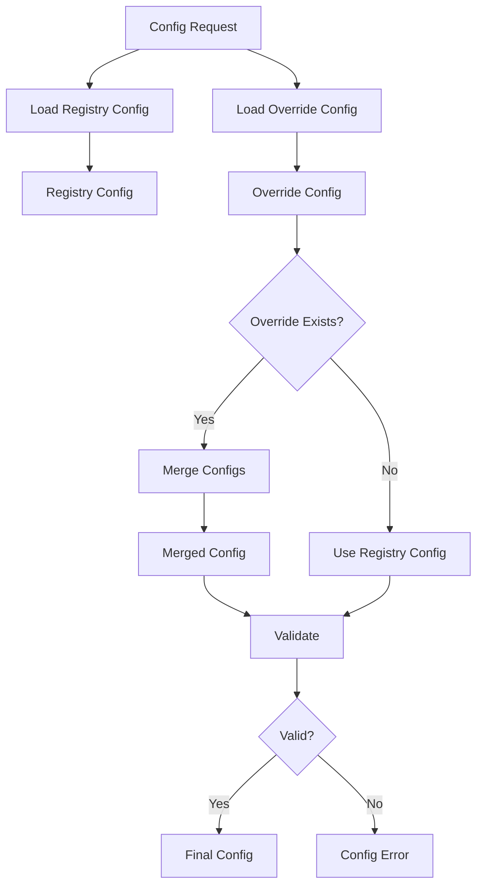

# Agent Discovery

Agent discovery is the dynamic process of analyzing projects and selecting the appropriate agent for a given task. The Mimir orchestrator uses project analysis, repository structure inspection, and configuration to determine which agent to spawn.

## Overview

Agent discovery handles:
- **Project Type Detection**: Identify the language/stack (Go, Python, TypeScript, Rust)
- **Repository Analysis**: Analyze structure and dependencies
- **Agent Selection**: Choose appropriate agent from registry or project overrides
- **Configuration Loading**: Load agent-specific configuration
- **Hybrid Resolution**: Merge registry defaults with project-specific overrides

## Discovery Flow



## Project Type Detection

### Detection Methods

The orchestrator uses multiple heuristics to detect project type:

1. **File Extensions**: Analyze source file extensions
2. **Configuration Files**: Detect build/config files (go.mod, package.json, Cargo.toml, etc.)
3. **Dependency Files**: Parse dependency manifests
4. **Language Server**: Use LSP if available
5. **Manual Configuration**: Respect project-specific overrides

### Detection Heuristics

| Language | Key Files | Extensions | Detection Priority |
|----------|-----------|------------|-------------------|
| Go | go.mod, go.sum, main.go | .go | High |
| Python | requirements.txt, pyproject.toml, setup.py | .py | High |
| TypeScript/Node | package.json, tsconfig.json | .ts, .tsx, .js | High |
| Rust | Cargo.toml, Cargo.lock | .rs | High |
| Python | setup.cfg, Pipfile | .py | Medium |
| TypeScript/Node | yarn.lock, pnpm-lock.yaml | .ts, .js | Medium |

### Detection Algorithm



## Repository Analysis

### Structure Analysis

The orchestrator analyzes repository structure:



### Monorepo Detection

For monorepos, the orchestrator:
1. Detects multiple sub-projects
2. Analyzes each sub-project independently
3. Spawns appropriate agents per sub-project
4. Coordinates work across agents

### Framework Detection

The orchestrator also detects frameworks to help with agent selection:

| Framework | Files | Agent Implication |
|-----------|-------|-------------------|
| React | package.json with react dependency | Frontend TypeScript agent |
| Express | package.json with express dependency | Backend TypeScript agent |
| Django | settings.py, manage.py | Backend Python agent |
| Flask | app.py, requirements.txt with flask | Backend Python agent |
| Next.js | next.config.js, pages/ directory | Frontend TypeScript agent |
| Gin | go.mod with gin dependency | Backend Golang agent |

## Agent Selection

### Selection Criteria

The orchestrator selects agents based on:

1. **Language Match**: Agent expertise matches project language
2. **Stack Match**: Agent familiar with project's framework/stack
3. **Task Type**: Agent capabilities match task requirements
4. **Configuration**: Project-specific overrides take precedence
5. **Availability**: Agent is defined and available

### Selection Decision Tree



### Agent Capabilities Mapping

Each agent has defined capabilities:

| Agent | Languages | Frameworks | Tasks |
|-------|-----------|-------------|-------|
| Backend Golang | Go | Gin, Echo, Fiber | API dev, microservices |
| Backend Python | Python | Django, Flask, FastAPI | API dev, data processing |
| Backend TypeScript | TypeScript/Node | Express, NestJS | API dev, microservices |
| Frontend TypeScript | TypeScript/React | React, Next.js, UI frameworks | UI development, state management |
| Backend Rust | Rust | Actix, Rocket, Axum | High-performance services |
| Documentation | Multiple | N/A | API docs, README, guides |
| Research | Multiple | N/A | Research, analysis, best practices |
| Code Review | Multiple | N/A | PR reviews, security audits |
| Sentry Triage | Multiple | N/A | Sentry event analysis |

## Hybrid Agent Resolution

### Registry vs Overrides

The orchestrator uses a hybrid approach:



### Override Merge Rules

When merging registry defaults with project overrides:

1. **Description**: Override takes precedence
2. **Model**: Override takes precedence
3. **Temperature**: Override takes precedence
4. **Steps**: Override takes precedence
5. **Permissions**: Merged (override + registry)
6. **Instructions**: Appended (registry + override)

### Override Priority

```
Project Override (.opencode/agent/*.md)
    ↓
Registry Default (/docs/agents-examples/registry/*.md)
    ↓
Agent Factory Defaults
```

## Configuration Loading

### Agent Configuration Format

Agent configuration follows opencode's format:

```yaml
---
description: Agent description
color: "#RRGGBB"
model: anthropic/claude-sonnet-4
mode: primary
temperature: 0.7
steps: 100
permission:
  edit:
    "**/*.go": allow
    "**/*.md": allow
    "*": ask
  bash:
    "go build *": allow
    "go test *": allow
    "*": ask
  external_directory: deny
---
```

### Configuration Sources

1. **Registry**: `/docs/agents-examples/registry/{agent-name}.md`
2. **Project Override**: `{project}/.opencode/agent/{agent-name}.md`
3. **Runtime Config**: Environment variables, command-line flags

### Configuration Resolution



## Discovery Examples

### Example 1: Go Backend Project

**Repository**: `/path/to/api-server`

**Files detected**:
- `go.mod`
- `main.go`
- `internal/auth/login.go`
- `cmd/server/main.go`

**Detection result**:
- **Language**: Go
- **Type**: Backend
- **Framework**: Gin (detected in go.mod)

**Agent selected**: `backend-golang`

**Configuration loaded**:
- Registry: `/docs/agents-examples/registry/backend-golang-agent.md`
- Override: Checked `.opencode/agent/backend-golang-agent.md` (not found)
- Final: Use registry default

### Example 2: React Frontend Project

**Repository**: `/path/to/web-app`

**Files detected**:
- `package.json` (contains react dependency)
- `tsconfig.json`
- `src/App.tsx`
- `src/components/Button.tsx`

**Detection result**:
- **Language**: TypeScript
- **Type**: Frontend
- **Framework**: React

**Agent selected**: `frontend-typescript`

### Example 3: Monorepo with Multiple Projects

**Repository**: `/path/to/monorepo`

**Structure detected**:
```
/
├── backend-api/
│   ├── go.mod
│   └── main.go
├── frontend-web/
│   ├── package.json
│   └── tsconfig.json
└── shared/
    └── package.json
```

**Detection result**:
- **Backend API**: Go → `backend-golang` agent
- **Frontend Web**: TypeScript → `frontend-typescript` agent
- **Shared**: TypeScript → `backend-typescript` or `frontend-typescript` based on context

**Agent selection**: Spawn multiple agents for each sub-project

## Discovery API

The orchestrator provides a discovery API:

```typescript
// Detect project type
const projectType = await agentDiscovery.detectProjectType(projectPath)

// Select agent for task
const agent = await agentDiscovery.selectAgent({
  projectPath,
  taskType,
  taskDescription
})

// Load agent configuration
const config = await agentDiscovery.loadAgentConfig(agentName)

// List available agents
const agents = await agentDiscovery.listAgents()
```

## Caching and Performance

### Discovery Caching

To improve performance, discovery results are cached:

- **Project type cache**: Cached for 1 hour
- **Agent config cache**: Cached until modified
- **Registry cache**: Loaded once on startup

### Cache Invalidation

Cache is invalidated when:
- Files in project change (detected via file watcher)
- Registry definitions are updated
- Override files are created/modified
- Explicit cache flush requested

## Error Handling

### Discovery Failures

| Scenario | Handling |
|----------|----------|
| Unknown project type | Use default agent, log warning |
| No agent available for type | Use general-purpose agent, log error |
| Invalid agent config | Log error, use registry default |
| Missing required fields | Log error, use factory defaults |
| Override parse error | Log error, use registry default |

### Fallback Strategy

When discovery fails:
1. Try to use a general-purpose agent
2. Request human intervention
3. Create GitHub issue with discovery error
4. Allow manual agent selection via CLI/API

## Next Steps

- [Agent Workflows](./agents-workflow.md) - Learn how agents work together in workflows
- [Agent Isolation](./agents-isolation.md) - Understand git worktree isolation
- [Examples](./agents-examples/) - See discovery in action
