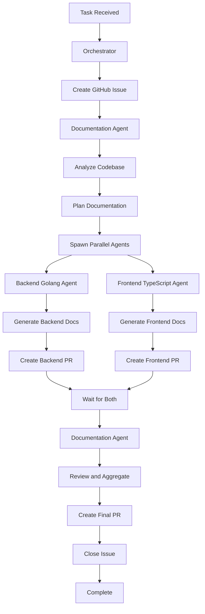
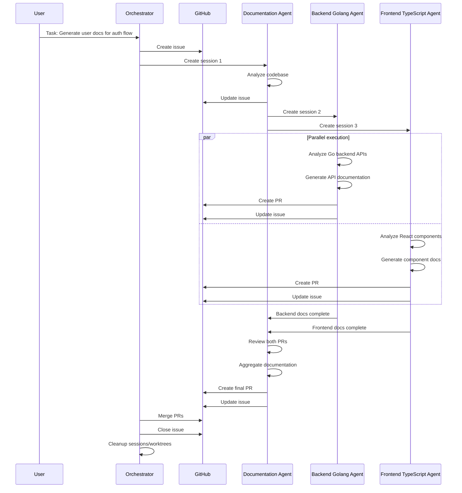

# Multi-Agent Task Example

Example of a complex task requiring coordination between multiple specialized agents working across different parts of a codebase.

## Overview

This example demonstrates a multi-agent task: **Adding user documentation to a Go backend and React frontend**.

### Task Description

"Generate comprehensive user documentation for the authentication flow, covering both the Go backend API and React frontend components."

### Agents Involved

1. **Documentation Agent** - Orchestrates documentation generation
2. **Backend Golang Agent** - Documents Go backend APIs
3. **Frontend TypeScript Agent** - Documents React components
4. **Orchestrator** - Coordinates agents and merges changes

## Workflow Diagram



## Sequence Diagram



## Step-by-Step Walkthrough

### Step 1: Task Received and Issue Created

**User Request**:
```
Generate comprehensive user documentation for the authentication flow,
covering both the Go backend API and React frontend components.
```

**Orchestrator Creates Issue**:
```markdown
# [Mimir] Generate user documentation for authentication flow

## Task Details
**Description**: Generate comprehensive user documentation for authentication flow

**Scope**:
- Go backend APIs (login, logout, password reset)
- React frontend components (LoginForm, RegisterForm, ResetPassword)
- Integration points and data flow

## Agents Involved
- Documentation Agent (orchestrator)
- Backend Golang Agent (backend docs)
- Frontend TypeScript Agent (frontend docs)

## Progress
- [ ] Analyze codebase
- [ ] Generate backend documentation
- [ ] Generate frontend documentation
- [ ] Review and aggregate
- [ ] Create final PR
- [ ] Merge and close

## Labels
- mimir
- mimir-agent-documentation
- mimir-task-docs-001
- in-progress
```

### Step 2: Documentation Agent Analyzes Codebase

**Documentation Agent Session**:
- Session ID: `01JABC123DEF456`
- Agent: `documentation`
- Directory: Repository root

**Agent Analysis**:

**Backend Structure**:
```
backend/
├── internal/auth/
│   ├── handler.go        # HTTP handlers
│   ├── service.go        # Business logic
│   └── models.go        # Data models
├── api/
│   └── routes.go        # Route definitions
└── docs/
    └── api.md           # Existing API docs (partial)
```

**Frontend Structure**:
```
frontend/
├── src/
│   ├── components/
│   │   ├── auth/
│   │   │   ├── LoginForm.tsx
│   │   │   ├── RegisterForm.tsx
│   │   │   └── ResetPassword.tsx
│   │   └── api/
│   │       └── auth.ts  # API client
│   └── pages/
│       ├── Login.tsx
│       ├── Register.tsx
│       └── ResetPassword.tsx
└── docs/
    └── components.md    # Existing component docs (partial)
```

**Agent Updates Issue**:
```markdown
### Progress Update

**Status**: Analysis Complete

**Codebase Structure**:

**Backend (Go)**:
- API Endpoints:
  - POST /api/auth/login
  - POST /api/auth/register
  - POST /api/auth/logout
  - POST /api/auth/reset-password
- Services: auth service
- Models: User, AuthToken

**Frontend (React/TypeScript)**:
- Components: LoginForm, RegisterForm, ResetPassword
- API Client: auth.ts
- Pages: Login, Register, ResetPassword

**Documentation Plan**:
1. Backend Golang Agent: Generate API endpoint documentation
2. Frontend TypeScript Agent: Generate component documentation
3. Documentation Agent: Aggregate and create user guide

**Next Steps**: Spawning parallel agents

---

**Timestamp**: 2025-01-03T09:00:00Z
**Agent**: documentation
```

### Step 3: Parallel Agent Execution

#### Backend Golang Agent

**Session**:
- Session ID: `01JDEF789GHI012`
- Agent: `backend-golang`
- Worktree: `mimir/backend-golang/01JDEF789GHI012`
- Branch: `mimir-01JDEF789GHI012`

**Agent Analyzes Backend APIs**:

**Login Endpoint**:
```go
// POST /api/auth/login
// Request: { username: string, password: string }
// Response: { token: string, user: User } | { error: string }
```

**Register Endpoint**:
```go
// POST /api/auth/register
// Request: { username: string, email: string, password: string }
// Response: { token: string, user: User } | { error: string }
```

**Agent Generates Documentation**:

File: `backend/docs/user-guide/authentication.md`
```markdown
# Authentication API Documentation

## Overview
The authentication API provides endpoints for user registration, login, logout, and password reset.

## Authentication
All protected endpoints require a Bearer token in the Authorization header:
```
Authorization: Bearer {token}
```

## Endpoints

### Login
**POST** `/api/auth/login`

Authenticate a user and receive an access token.

**Request Body**:
```json
{
  "username": "johndoe",
  "password": "securepassword123"
}
```

**Success Response** (200 OK):
```json
{
  "token": "eyJhbGciOiJIUzI1NiIsInR5cCI6IkpXVCJ9...",
  "user": {
    "id": "123",
    "username": "johndoe",
    "email": "john@example.com"
  }
}
```

**Error Response** (401 Unauthorized):
```json
{
  "error": "Invalid username or password"
}
```

### Register
**POST** `/api/auth/register`

Register a new user account.

**Request Body**:
```json
{
  "username": "johndoe",
  "email": "john@example.com",
  "password": "securepassword123"
}
```

**Success Response** (201 Created):
```json
{
  "token": "eyJhbGciOiJIUzI1NiIsInR5cCI6IkpXVCJ9...",
  "user": {
    "id": "123",
    "username": "johndoe",
    "email": "john@example.com"
  }
}
```

**Error Response** (400 Bad Request):
```json
{
  "error": "Username already exists"
}
```

### Logout
**POST** `/api/auth/logout`

Invalidate the current access token.

**Headers**:
```
Authorization: Bearer {token}
```

**Success Response** (200 OK):
```json
{
  "message": "Logged out successfully"
}
```

### Reset Password
**POST** `/api/auth/reset-password`

Initiate password reset for a user.

**Request Body**:
```json
{
  "email": "john@example.com"
}
```

**Success Response** (200 OK):
```json
{
  "message": "Password reset email sent"
}
```
```

**Agent Updates Issue**:
```markdown
### Progress Update

**Status**: In Progress

**Completed Steps**:
- ✅ Created worktree
- ✅ Analyzed backend APIs
- ✅ Generated API documentation

**Current Step**: Creating PR

**Files Created**:
- backend/docs/user-guide/authentication.md

**Documentation Coverage**:
- Login endpoint (request/response)
- Register endpoint (request/response)
- Logout endpoint
- Reset password endpoint

---

**Timestamp**: 2025-01-03T09:15:00Z
**Agent**: backend-golang
```

#### Frontend TypeScript Agent

**Session**:
- Session ID: `01JKLM345NOP678`
- Agent: `frontend-typescript`
- Worktree: `mimir/frontend-typescript/01JKLM345NOP678`
- Branch: `mimir-01JKLM345NOP678`

**Agent Analyzes Frontend Components**:

**LoginForm Component**:
```typescript
interface LoginFormProps {
  onLogin: (credentials: Credentials) => void;
  loading?: boolean;
  error?: string;
}
```

**RegisterForm Component**:
```typescript
interface RegisterFormProps {
  onRegister: (data: RegisterData) => void;
  loading?: boolean;
  error?: string;
}
```

**Agent Generates Documentation**:

File: `frontend/docs/user-guide/components.md`
```markdown
# Authentication Components Documentation

## Overview
The authentication components provide user interface elements for logging in, registering, and resetting passwords.

## Components

### LoginForm
A form component for user authentication.

**Props**:
| Prop | Type | Required | Description |
|------|------|----------|-------------|
| `onLogin` | `(credentials: Credentials) => void` | Yes | Callback fired when login is submitted |
| `loading` | `boolean` | No | Shows loading spinner if true |
| `error` | `string` | No | Displays error message if provided |

**Credentials Interface**:
```typescript
interface Credentials {
  username: string;
  password: string;
}
```

**Usage Example**:
```tsx
<LoginForm
  onLogin={(credentials) => {
    // Handle login
    api.auth.login(credentials);
  }}
  loading={isLoading}
  error={errorMessage}
/>
```

**Features**:
- Username and password input fields
- Client-side validation
- Error message display
- Loading state
- "Remember me" checkbox
- "Forgot password" link

### RegisterForm
A form component for user registration.

**Props**:
| Prop | Type | Required | Description |
|------|------|----------|-------------|
| `onRegister` | `(data: RegisterData) => void` | Yes | Callback fired when registration is submitted |
| `loading` | `boolean` | No | Shows loading spinner if true |
| `error` | `string` | No | Displays error message if provided |

**RegisterData Interface**:
```typescript
interface RegisterData {
  username: string;
  email: string;
  password: string;
  confirmPassword: string;
}
```

**Usage Example**:
```tsx
<RegisterForm
  onRegister={(data) => {
    // Handle registration
    api.auth.register(data);
  }}
  loading={isLoading}
  error={errorMessage}
/>
```

**Features**:
- Username, email, and password input fields
- Confirm password field with matching validation
- Client-side validation
- Error message display
- Loading state
- Password strength indicator

### ResetPassword
A form component for password reset.

**Props**:
| Prop | Type | Required | Description |
|------|------|----------|-------------|
| `onReset` | (email: string) => void` | Yes | Callback fired when reset is requested |
| `loading` | `boolean` | No | Shows loading spinner if true |
| `error` | `string` | No | Displays error message if provided |

**Usage Example**:
```tsx
<ResetPassword
  onReset={(email) => {
    // Handle password reset
    api.auth.resetPassword(email);
  }}
  loading={isLoading}
  error={errorMessage}
/>
```

**Features**:
- Email input field
- Email format validation
- Error message display
- Loading state
- Success message after submission

## API Client

The authentication API client provides methods for interacting with the backend.

```typescript
import { api } from './api/auth';

// Login
await api.auth.login({ username, password });

// Register
await api.auth.register({ username, email, password });

// Logout
await api.auth.logout();

// Reset password
await api.auth.resetPassword({ email });
```

## Usage Flow

1. **Login**: User enters credentials → `LoginForm` calls `api.auth.login()` → Token stored → Redirect to dashboard
2. **Register**: User enters registration data → `RegisterForm` calls `api.auth.register()` → Token stored → Redirect to dashboard
3. **Reset Password**: User enters email → `ResetPassword` calls `api.auth.resetPassword()` → Email sent → Display success message
```

**Agent Updates Issue**:
```markdown
### Progress Update

**Status**: In Progress

**Completed Steps**:
- ✅ Created worktree
- ✅ Analyzed frontend components
- ✅ Generated component documentation

**Current Step**: Creating PR

**Files Created**:
- frontend/docs/user-guide/components.md

**Documentation Coverage**:
- LoginForm component
- RegisterForm component
- ResetPassword component
- API client usage

---

**Timestamp**: 2025-01-03T09:20:00Z
**Agent**: frontend-typescript
```

### Step 4: Both Agents Create PRs

**Backend Golang Agent PR**:
```markdown
## [Mimir] Generate backend API documentation

### Agent Information
- **Agent Type**: backend-golang
- **Tracking Issue**: #456

### Changes
**Summary**: Generate comprehensive API documentation for authentication endpoints.

**Files Created**:
- backend/docs/user-guide/authentication.md

### Documentation Coverage
- Login endpoint
- Register endpoint
- Logout endpoint
- Reset password endpoint

### Related Issue
Closes #456

### Checklist
- [x] All endpoints documented
- [x] Request/response examples provided
- [x] Error handling documented
```

**Frontend TypeScript Agent PR**:
```markdown
## [Mimir] Generate frontend component documentation

### Agent Information
- **Agent Type**: frontend-typescript
- **Tracking Issue**: #456

### Changes
**Summary**: Generate comprehensive component documentation for authentication UI.

**Files Created**:
- frontend/docs/user-guide/components.md

### Documentation Coverage
- LoginForm component
- RegisterForm component
- ResetPassword component
- API client usage

### Related Issue
Closes #456

### Checklist
- [x] All components documented
- [x] Props interfaces documented
- [x] Usage examples provided
```

### Step 5: Documentation Agent Aggregates

**Documentation Agent Reviews PRs**:
- Backend docs: PR #789 - Complete and accurate
- Frontend docs: PR #790 - Complete and accurate

**Agent Creates User Guide**:

File: `docs/user-guide/authentication.md`
```markdown
# Authentication User Guide

## Overview
This guide explains how users can authenticate with the application, including login, registration, and password reset.

## Table of Contents
1. [Registering an Account](#registering-an-account)
2. [Logging In](#logging-in)
3. [Logging Out](#logging-out)
4. [Resetting Your Password](#resetting-your-password)
5. [Troubleshooting](#troubleshooting)

## Registering an Account

To create a new account:

1. Navigate to the registration page
2. Enter your username, email, and password
3. Confirm your password
4. Click "Register"

**Password Requirements**:
- At least 8 characters
- At least one uppercase letter
- At least one number

Once registered, you'll be automatically logged in and redirected to the dashboard.

## Logging In

To log in to your account:

1. Navigate to the login page
2. Enter your username and password
3. Optionally, check "Remember me" to stay logged in
4. Click "Login"

If your credentials are correct, you'll be redirected to the dashboard.

**Troubleshooting Login Issues**:
- Ensure your username and password are correct
- Check if Caps Lock is enabled
- If you've forgotten your password, use the "Forgot Password" link

## Logging Out

To log out of your account:

1. Click on your profile icon in the top-right corner
2. Select "Logout" from the dropdown menu
3. Confirm logout

You'll be redirected to the login page.

## Resetting Your Password

If you've forgotten your password:

1. Navigate to the login page
2. Click "Forgot Password"
3. Enter your email address
4. Click "Send Reset Link"

You'll receive an email with instructions to reset your password.

**Note**: The password reset link expires after 24 hours.

## Troubleshooting

### Account Locked
If you've made multiple failed login attempts, your account may be temporarily locked. Wait 15 minutes and try again, or contact support.

### Email Not Received
If you don't receive the password reset email:
- Check your spam folder
- Verify your email address is correct
- Contact support if the issue persists

### Session Expired
If you're logged out unexpectedly:
- Your session may have expired
- Simply log in again
- Check "Remember me" to stay logged in longer

## API Documentation

For developers integrating with the authentication API, see:
- [Backend API Documentation](../backend/docs/user-guide/authentication.md)
- [Frontend Component Documentation](../frontend/docs/user-guide/components.md)
```

**Agent Updates Issue**:
```markdown
### Progress Update

**Status**: Aggregation Complete

**Completed Steps**:
- ✅ Analyzed codebase
- ✅ Generated backend documentation (PR #789)
- ✅ Generated frontend documentation (PR #790)
- ✅ Reviewed both PRs
- ✅ Created aggregated user guide

**Current Step**: Creating final PR

**Files Created**:
- docs/user-guide/authentication.md (aggregated user guide)
- backend/docs/user-guide/authentication.md (API docs)
- frontend/docs/user-guide/components.md (component docs)

**Documentation Structure**:
- User-facing guide (docs/)
- Developer API docs (backend/docs/)
- Component docs (frontend/docs/)

---

**Timestamp**: 2025-01-03T09:45:00Z
**Agent**: documentation
```

### Step 6: Final PR and Merge

**Final PR Created**:
```markdown
## [Mimir] Complete authentication documentation

### Agent Information
- **Agent Type**: documentation (orchestrator)
- **Tracking Issue**: #456
- **Related PRs**: #789, #790

### Changes
**Summary**: Complete user and developer documentation for authentication flow.

**Files Created**:
- docs/user-guide/authentication.md (user guide)
- backend/docs/user-guide/authentication.md (API docs)
- frontend/docs/user-guide/components.md (component docs)

### Documentation Coverage
**User Guide**:
- Registration flow
- Login and logout
- Password reset
- Troubleshooting

**Developer Docs**:
- API endpoints (request/response)
- Component props and usage
- API client integration

### Related Issue
Closes #456

### Checklist
- [x] User-facing documentation
- [x] API documentation
- [x] Component documentation
- [x] Usage examples
- [x] Troubleshooting section
```

**Orchestrator Merges PRs**:
1. Merge backend docs PR (#789)
2. Merge frontend docs PR (#790)
3. Merge final aggregated PR (#791)

**Orchestrator Closes Issue**:
```markdown
### Task Complete

**Summary**: Successfully generated comprehensive authentication documentation

**Deliverables**:
- User guide: docs/user-guide/authentication.md
- API docs: backend/docs/user-guide/authentication.md
- Component docs: frontend/docs/user-guide/components.md

**Agents Involved**:
1. Documentation Agent (orchestration, aggregation)
2. Backend Golang Agent (API documentation)
3. Frontend TypeScript Agent (component documentation)

**Pull Requests**:
- PR #789: Backend API docs
- PR #790: Frontend component docs
- PR #791: Aggregated user guide

**Status**: All PRs merged successfully

---

**Timestamp**: 2025-01-03T10:00:00Z
**Agent**: orchestrator
```

## Timeline Summary

| Time | Event | Agent |
|------|-------|-------|
| 08:55:00 | Task received | - |
| 09:00:00 | Issue #456 created | Orchestrator |
| 09:00:30 | Documentation session created | Orchestrator |
| 09:15:00 | Backend docs complete | Backend Golang |
| 09:20:00 | Frontend docs complete | Frontend TypeScript |
| 09:45:00 | Aggregation complete | Documentation |
| 10:00:00 | All PRs merged | Orchestrator |
| 10:00:30 | Issue #456 closed | Orchestrator |
| 10:01:00 | Sessions/worktrees cleaned up | Orchestrator |

**Total Duration**: 66 minutes

## Key Observations

### Parallel Execution
- Backend and frontend agents worked simultaneously
- Reduced total duration by ~50%
- Each agent worked in isolated worktree

### Agent Coordination
- Documentation agent orchestrated the task
- Spawned parallel workers for backend and frontend
- Aggregated results into final user guide

### Tracking
- Single GitHub issue tracked entire workflow
- Multiple agents updated same issue
- All changes linked via PRs
- Complete audit trail

### Collaboration
- Maintainers could review individual PRs
- Human collaboration via GitHub comments
- Clear handoffs between agents

## Configuration Required

### Mimir Config

```yaml
# ~/.mimir/config.yaml
projects:
  - name: my-app
    path: /path/to/my-app
    opencode_port: 4096

agents:
  documentation:
    model: anthropic/claude-sonnet-4
    temperature: 0.6

  backend-golang:
    model: anthropic/claude-sonnet-4
    temperature: 0.7

  frontend-typescript:
    model: anthropic/claude-sonnet-4
    temperature: 0.7
```

## Next Steps

- [Sentry Workflow Example](./sentry-workflow.md) - See error resolution workflow
- [Agent Registry](./registry/) - Explore agent definitions used in this workflow
