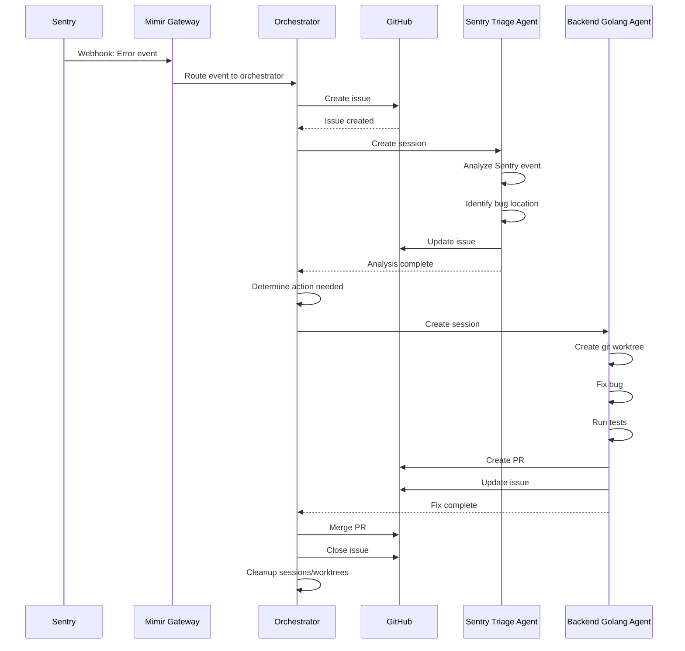

# Sentry Workflow Example

Complete end-to-end example of Sentry event handling and issue resolution using multiple agents.

## Overview

This workflow demonstrates how Mimir orchestrates agents to automatically resolve Sentry issues:

1. **Sentry webhook received** by Mimir gateway
2. **Mimir orchestrator** creates GitHub issue
3. **Sentry triage agent** analyzes event
4. **Backend Golang agent** fixes bug in isolated worktree
5. **PR created and reviewed**
6. **Issue closed on completion**

## Workflow Diagram



## Step-by-Step Walkthrough

### Step 1: Sentry Event Received

**Event Data**:
```json
{
  "event_id": "abc123def456",
  "level": "error",
  "message": "panic: runtime error: invalid memory address or nil pointer dereference",
  "stacktrace": {
    "frames": [
      {
        "filename": "src/auth/login.go",
        "lineno": 142,
        "function": "Login"
      }
    ]
  },
  "project": "my-api-prod",
  "environment": "production"
}
```

### Step 2: Orchestrator Creates GitHub Issue

**Issue Created**:
```markdown
# [Mimir] Fix nil pointer in authentication module

## Agent Information
- **Agent Type**: sentry-triage
- **Mimir Task ID**: task-abc123

## Sentry Event
- **Event ID**: abc123def456
- **Level**: error
- **Project**: my-api-prod
- **Environment**: production

## Error Details
**Message**: panic: runtime error: invalid memory address or nil pointer dereference

**Stack Trace**:
```
src/auth/login.go:142 in Login()
```

## Progress
- [ ] Analyze Sentry event
- [ ] Determine if action needed
- [ ] Spawn appropriate agent
- [ ] Implement fix
- [ ] Run tests
- [ ] Create PR
- [ ] Merge PR

## Labels
- mimir
- mimir-agent-sentry-triage
- mimir-task-abc123
- in-progress
```

### Step 3: Sentry Triage Agent Analysis

**Agent Session Created**:
- Session ID: `01JBQR8ZM5X8YPQW6K3E5V2N9J`
- Agent: `sentry-triage`
- Working directory: Repository root

**Agent Analysis**:
1. Fetches full Sentry event details
2. Analyzes stack trace
3. Identifies bug at `src/auth/login.go:142`
4. Determines this is a Go project
5. Recommends fix action

**Agent Updates Issue**:
```markdown
### Progress Update

**Status**: Analysis Complete

**Analysis Summary**:
- **Severity**: High - Production error causing login failures
- **Root Cause**: Nil pointer dereference in Login function
- **Location**: src/auth/login.go:142
- **Impact**: Users unable to authenticate

**Recommendation**: Immediate fix required

**Next Agent Requested**: backend-golang

**Context**:
The error occurs in the Login function when attempting to access a user object that is nil. This happens when authentication fails but the code doesn't handle the nil case properly.

---

**Timestamp**: 2025-01-03T10:15:30Z
**Agent**: sentry-triage
```

### Step 4: Orchestrator Spawns Backend Golang Agent

**Agent Session Created**:
- Session ID: `01JBQR8ZM5Y9AB4CD3EF6GH7I`
- Agent: `backend-golang`
- Worktree: `mimir/backend-golang/01JBQR8ZM5Y9AB4CD3EF6GH7I`
- Branch: `mimir-01JBQR8ZM5Y9AB4CD3EF6GH7I`

**Worktree Creation**:
```bash
git fetch origin/main
git checkout -b mimir-01JBQR8ZM5Y9AB4CD3EF6GH7I origin/main
git worktree add mimir/backend-golang/01JBQR8ZM5Y9AB4CD3EF6GH7I mimir-01JBQR8ZM5Y9AB4CD3EF6GH7I
```

### Step 5: Backend Golang Agent Fixes Bug

**Agent Reads Analysis from Issue**:
- Root cause: Nil pointer at `src/auth/login.go:142`
- Context: Login function doesn't handle nil user object

**Agent Analyzes Code**:
```go
// src/auth/login.go:140-145
func Login(username, password string) (*User, error) {
    user := db.GetUser(username)
    // Line 142: user might be nil if not found
    if user.Password != hash(password) {
        return nil, errors.New("invalid credentials")
    }
    return user, nil
}
```

**Agent Identifies Bug**:
- `user` is nil when `GetUser` doesn't find the user
- Line 142 accesses `user.Password` without nil check
- Need to add nil check before password validation

**Agent Implements Fix**:
```go
// src/auth/login.go:140-150
func Login(username, password string) (*User, error) {
    user := db.GetUser(username)
    if user == nil {
        return nil, errors.New("user not found")
    }
    if user.Password != hash(password) {
        return nil, errors.New("invalid credentials")
    }
    return user, nil
}
```

**Agent Updates Issue**:
```markdown
### Progress Update

**Status**: In Progress

**Completed Steps**:
- ✅ Created worktree: mimir/backend-golang/01JBQR8ZM5Y9AB4CD3EF6GH7I
- ✅ Analyzed code at src/auth/login.go:142
- ✅ Identified nil pointer bug
- ✅ Implemented fix with nil check

**Current Step**: Running tests

**Fix Details**:
Added nil check before accessing user.Password. If user is nil, return "user not found" error instead of panicking.

**Files Modified**:
- src/auth/login.go

---

**Timestamp**: 2025-01-03T10:30:45Z
**Agent**: backend-golang
```

### Step 6: Agent Runs Tests

**Test Execution**:
```bash
cd mimir/backend-golang/01JBQR8ZM5Y9AB4CD3EF6GH7I
go test ./src/auth/...
```

**Test Results**:
```
PASS
ok      github.com/owner/repo/src/auth    0.123s
```

**Agent Updates Issue**:
```markdown
### Progress Update

**Status**: In Progress

**Completed Steps**:
- ✅ Created worktree
- ✅ Analyzed code
- ✅ Identified bug
- ✅ Implemented fix
- ✅ Ran tests (all passing)

**Current Step**: Creating PR

**Test Results**:
- Tests run: 15
- Passed: 15
- Failed: 0

**Files Modified**:
- src/auth/login.go

---

**Timestamp**: 2025-01-03T10:35:22Z
**Agent**: backend-golang
```

### Step 7: Agent Creates PR

**Agent Commits Changes**:
```bash
cd mimir/backend-golang/01JBQR8ZM5Y9AB4CD3EF6GH7I
git add src/auth/login.go
git commit -m "Fix nil pointer in Login function"
git push origin mimir-01JBQR8ZM5Y9AB4CD3EF6GH7I
```

**PR Created**:
```markdown
## [Mimir] Fix nil pointer in authentication module

### Agent Information
- **Agent Type**: backend-golang
- **Agent Session ID**: 01JBQR8ZM5Y9AB4CD3EF6GH7I
- **Tracking Issue**: #123

### Changes
**Summary**: Add nil check before accessing user.Password in Login function to prevent panic.

**Files Modified**:
- src/auth/login.go

### Testing
**Tests Run**: `go test ./src/auth/...`
**Results**: All 15 tests passing

### Root Cause
Sentry event abc123def456 indicated nil pointer dereference at src/auth/login.go:142. The Login function was accessing user.Password without checking if user is nil.

### Fix
Added nil check before password validation. Returns "user not found" error if user is nil instead of panicking.

### Related Issue
Closes #123

### Checklist
- [x] Code follows Go best practices
- [x] Tests passing
- [x] No breaking changes
```

**Agent Updates Issue**:
```markdown
### Progress Update

**Status**: Pending Review

**Completed Steps**:
- ✅ Created worktree
- ✅ Analyzed code
- ✅ Identified bug
- ✅ Implemented fix
- ✅ Ran tests
- ✅ Created PR

**PR Details**:
- PR #456: Fix nil pointer in authentication module
- Link: https://github.com/owner/repo/pull/456

**Next Steps**: Awaiting review and approval

---

**Timestamp**: 2025-01-03T10:40:00Z
**Agent**: backend-golang
```

### Step 8: Orchestrator Merges PR

**Orchestrator Monitors PR**:
- Waits for approval from maintainers
- Once approved, merges PR
- Deletes feature branch

**Merge Command**:
```bash
gh pr merge 456 --merge --delete-branch
```

**Orchestrator Updates Issue**:
```markdown
### Progress Update

**Status**: Merged

**Completed Steps**:
- ✅ Created worktree
- ✅ Analyzed code
- ✅ Implemented fix
- ✅ Ran tests
- ✅ Created PR
- ✅ PR approved
- ✅ PR merged to main

**Merge Details**:
- PR #456 merged successfully
- Branch mimir-01JBQR8ZM5Y9AB4CD3EF6GH7I deleted
- Fix now deployed to main

---

**Timestamp**: 2025-01-03T11:00:00Z
**Agent**: orchestrator
```

### Step 9: Cleanup

**Orchestrator Closes Issue**:
```markdown
### Task Complete

**Summary**: Successfully fixed nil pointer in authentication module

**Resolution**:
- Bug fixed and tested
- PR merged to main
- Sentry event resolved
- No further action needed

**Agents Involved**:
1. sentry-triage (analysis)
2. backend-golang (fix)

**GitHub Issue**: #123
**Pull Request**: #456

---

**Timestamp**: 2025-01-03T11:05:00Z
**Agent**: orchestrator
```

**Worktree Cleanup**:
```bash
git worktree remove mimir/backend-golang/01JBQR8ZM5Y9AB4CD3EF6GH7I
```

**Session Cleanup**:
```typescript
await client.session.delete('01JBQR8ZM5X8YPQW6K3E5V2N9J')
await client.session.delete('01JBQR8ZM5Y9AB4CD3EF6GH7I')
```

## Timeline Summary

| Time | Event | Agent |
|------|-------|-------|
| 10:00:00 | Sentry webhook received | - |
| 10:00:15 | GitHub issue #123 created | Orchestrator |
| 10:00:30 | Sentry triage session created | Orchestrator |
| 10:15:30 | Analysis complete, issue updated | Sentry Triage |
| 10:20:00 | Backend Golang session created | Orchestrator |
| 10:25:00 | Worktree created | Backend Golang |
| 10:30:45 | Bug fixed | Backend Golang |
| 10:35:22 | Tests passing | Backend Golang |
| 10:40:00 | PR #456 created | Backend Golang |
| 11:00:00 | PR merged | Orchestrator |
| 11:05:00 | Issue #123 closed | Orchestrator |
| 11:05:30 | Worktrees and sessions cleaned up | Orchestrator |

**Total Duration**: 65 minutes

## Key Observations

### Agent Coordination
- **Sentry triage agent** performed initial analysis
- **Orchestrator** determined next steps and spawned backend agent
- **Backend Golang agent** performed the actual fix
- **Orchestrator** handled merge and cleanup

### Isolation
- Each agent worked in its own session
- Backend agent used isolated git worktree
- No conflicts with other potential concurrent agents
- Changes isolated until PR merge

### Tracking
- **Single GitHub issue** tracked entire workflow
- **Multiple agents** updated same issue with progress
- **PR linked** to issue for traceability
- **Complete audit trail** in issue comments

### Collaboration
- Maintainers could review PR before merge
- Human collaboration via GitHub comments
- Clear handoff between agents via issue updates

## Configuration Required

### Mimir Config

```yaml
# ~/.mimir/config.yaml
projects:
  - name: my-api
    path: /path/to/my-api
    opencode_port: 4096

webhooks:
  sentry:
    secret: ${SENTRY_WEBHOOK_SECRET}
    projects:
      - sentry_project: my-api-prod
        mimir_project: my-api
```

### Sentry Webhook Configuration

```yaml
# Sentry project settings
- URL: https://mimir.example.com/webhooks/sentry
- Secret: ${SENTRY_WEBHOOK_SECRET}
- Events: error, issue
```

## Next Steps

- [Multi-Agent Task Example](./multi-agent-task.md) - See agents coordinating on complex tasks
- [Agent Registry](./registry/) - Explore agent definitions used in this workflow
