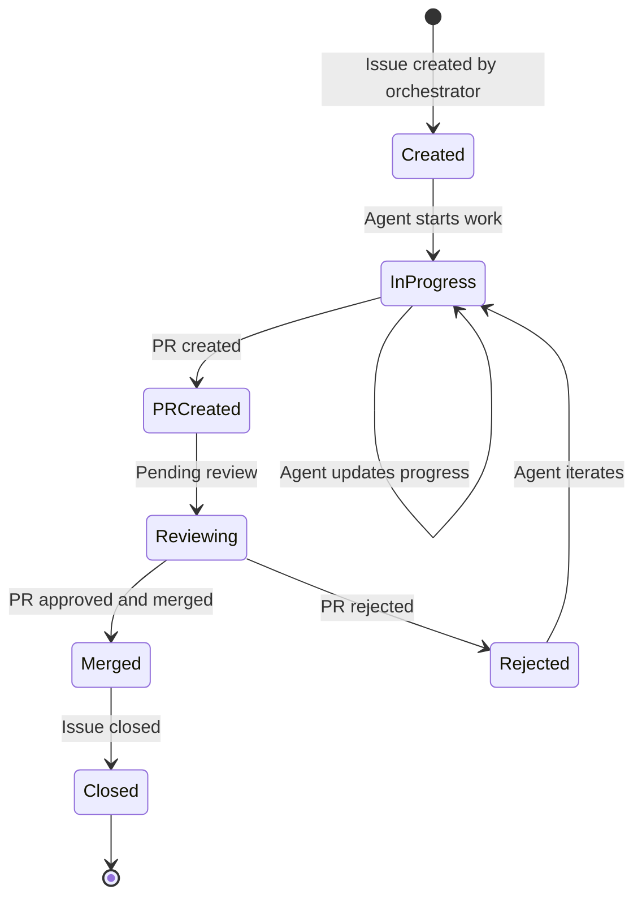
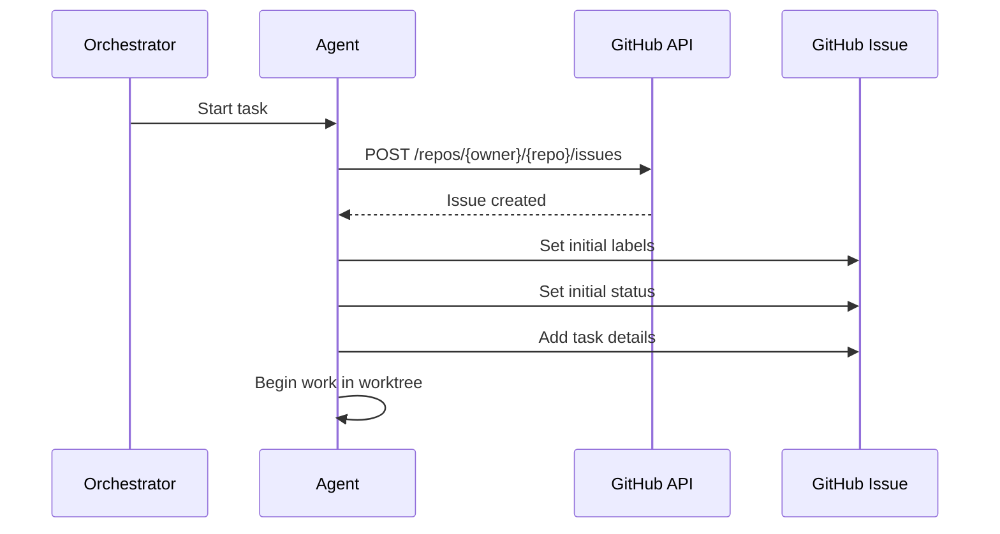
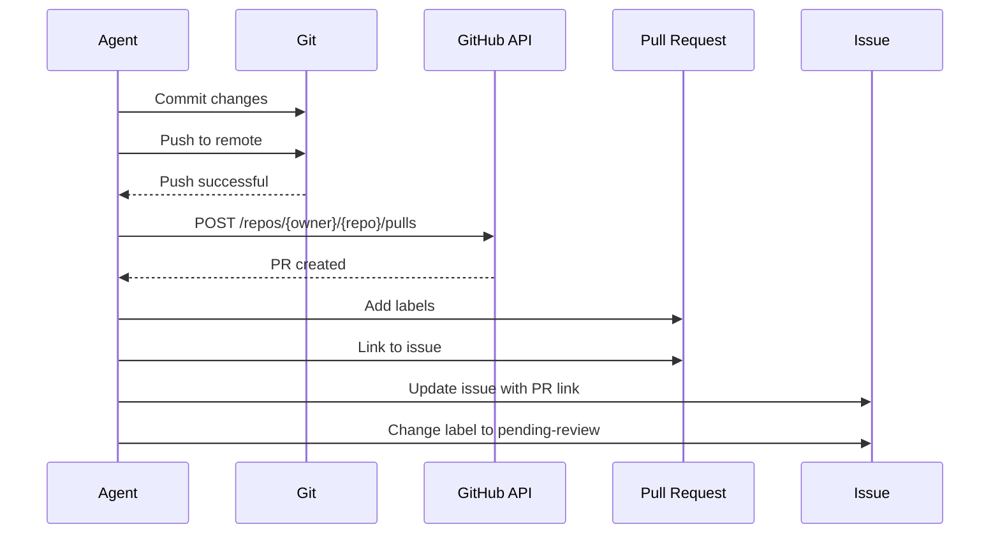
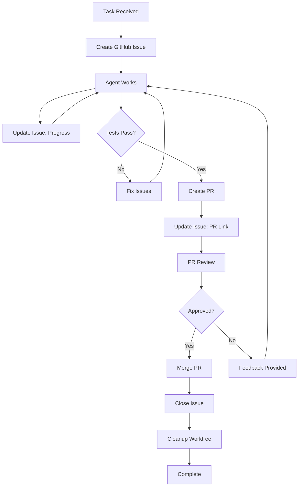
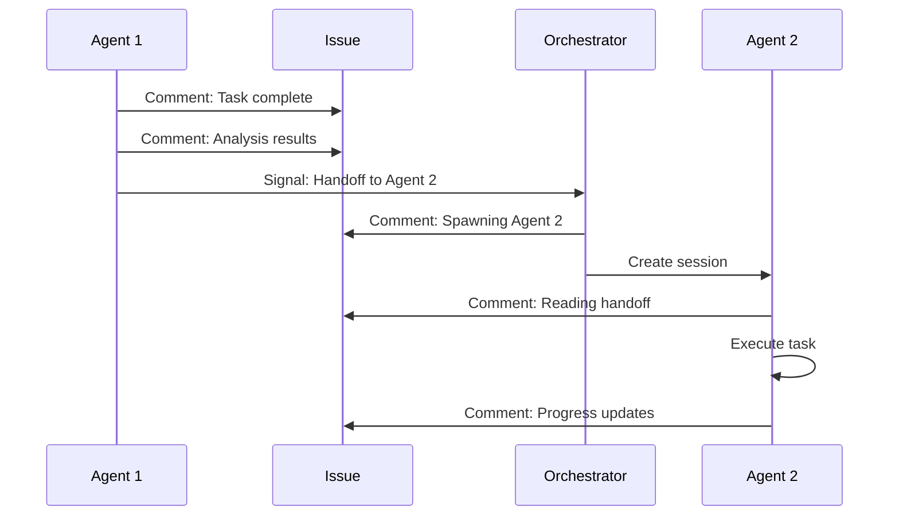
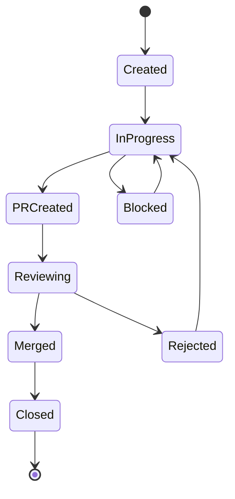
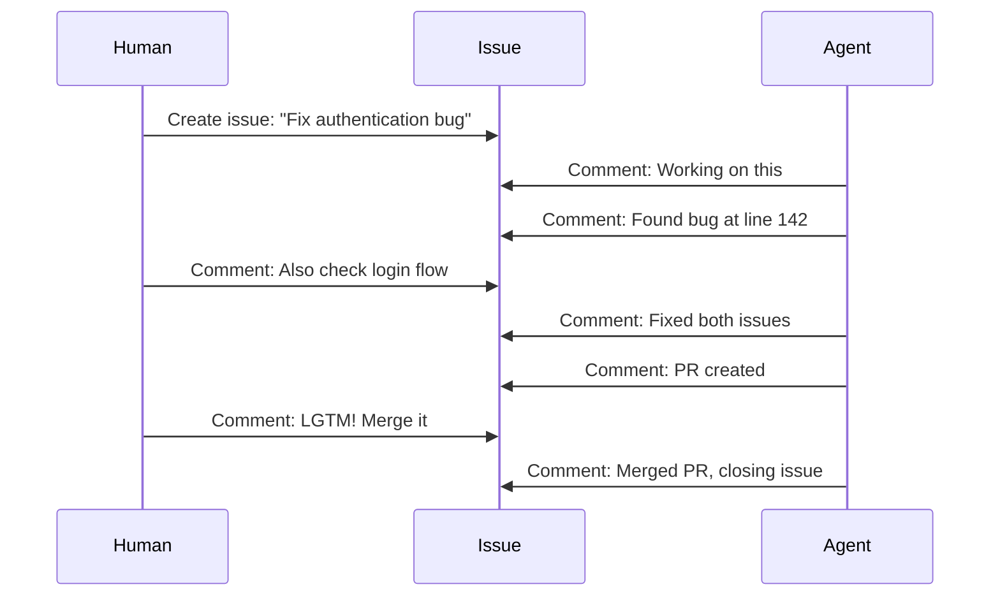
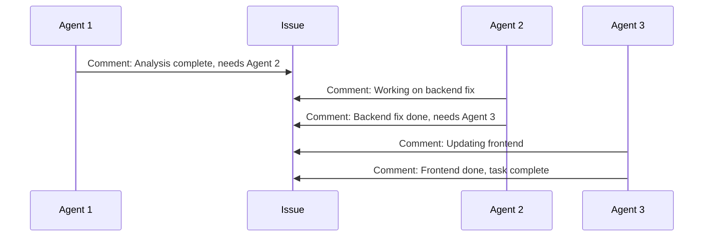

# GitHub Integration

GitHub integration enables agents to track work via issues, create pull requests for review, and coordinate changes through the standard GitHub workflow. One GitHub issue per task provides clear visibility, monitoring, and multiplayer collaboration.

## Overview

GitHub integration provides:
- **Issue tracking**: One GitHub issue per agent task
- **Progress updates**: Agents update issues via comments
- **PR creation**: Agents create PRs for review
- **Label management**: Labels for agent types and status
- **Multiplayer collaboration**: Humans and agents can collaborate
- **Complete history**: Full audit trail of all agent work

## Issue Lifecycle



## Issue Creation

### Issue Template

Every agent task creates a GitHub issue with a standardized template:

```markdown
# [Mimir] {Task Description}

## Agent Information
- **Agent Type**: {agent-type}
- **Agent Session ID**: {session-id}
- **Mimir Task ID**: {task-id}

## Worktree Information
- **Branch**: mimir-{session-id}
- **Worktree Path**: mimir/{agent-type}/{session-id}

## Task Details
**Description**: {Detailed task description}

**Context**: {Additional context from triggering event}

**Dependencies**: {Any dependencies on other tasks}

## Progress
- [ ] Create worktree
- [ ] Analyze requirements
- [ ] Implement solution
- [ ] Run tests
- [ ] Create PR
- [ ] Awaiting review
- [ ] Completed

## Handoff
**From Agent**: {previous-agent-name} (if applicable)
**Analysis**: {analysis from previous agent}

## Labels
- mimir
- mimir-agent-{agent-type}
- mimir-task-{task-id}
- in-progress
```

### Issue Labels

Standard labels for agent issues:

| Label | Purpose | Examples |
|-------|---------|----------|
| `mimir` | Identifies agent-created issues | All agent issues |
| `mimir-agent-{type}` | Agent type | `mimir-agent-backend-golang` |
| `mimir-task-{id}` | Task tracking | `mimir-task-abc123` |
| `in-progress` | Agent actively working | During execution |
| `pending-review` | PR created, awaiting review | After PR creation |
| `completed` | Task finished successfully | After completion |
| `blocked` | Task blocked, waiting | When dependencies not met |
| `failed` | Task failed | On agent failure |

### Issue Creation Flow



## Progress Updates

### Update Pattern

Agents update issues at key milestones:

```markdown
### Progress Update

**Status**: {status}

**Completed Steps**:
- ✅ {step 1}
- ✅ {step 2}

**Current Step**: {current step}

**Details**: {additional details}

**Artifacts**:
- Files modified: {file list}
- Tests run: {test results}
- PR: #{pr-number} (if created)

---

**Timestamp**: {ISO timestamp}
**Agent**: {agent-type}
```

### Update Examples

**Initial Work Start**:
```markdown
### Progress Update

**Status**: In Progress

**Completed Steps**:
- ✅ Created GitHub issue
- ✅ Created git worktree: mimir/backend-golang/01JBQR8ZM5X8YPQW6K3E5V2N9J
- ✅ Checked out branch: mimir-01JBQR8ZM5X8YPQW6K3E5V2N9J

**Current Step**: Analyzing Sentry event

---

**Timestamp**: 2025-01-03T10:15:30Z
**Agent**: backend-golang
```

**After Fix Implementation**:
```markdown
### Progress Update

**Status**: In Progress

**Completed Steps**:
- ✅ Created GitHub issue
- ✅ Created git worktree
- ✅ Analyzed Sentry event
- ✅ Identified bug in /src/auth/login.go:142
- ✅ Implemented null pointer fix
- ✅ Ran unit tests (all passing)

**Current Step**: Creating PR

**Details**: Fixed null pointer exception in authentication module. Added nil check before accessing user object.

**Artifacts**:
- Files modified: src/auth/login.go
- Tests: 15 passed, 0 failed
- Branch: mimir-01JBQR8ZM5X8YPQW6K3E5V2N9J

---

**Timestamp**: 2025-01-03T10:45:22Z
**Agent**: backend-golang
```

**PR Created**:
```markdown
### Progress Update

**Status**: Pending Review

**Completed Steps**:
- ✅ Created GitHub issue
- ✅ Created git worktree
- ✅ Analyzed Sentry event
- ✅ Implemented fix
- ✅ Ran tests
- ✅ Created PR

**PR Details**:
- PR #456: Fix null pointer in authentication module
- Link: https://github.com/owner/repo/pull/456

**Next Steps**: Awaiting review and approval

---

**Timestamp**: 2025-01-03T11:00:00Z
**Agent**: backend-golang
```

## Pull Request Creation

### PR Template

Agents create PRs with a standardized template:

```markdown
## [Mimir] {PR Title}

### Agent Information
- **Agent Type**: {agent-type}
- **Agent Session ID**: {session-id}
- **Tracking Issue**: #{issue-number}

### Changes
**Summary**: {Brief summary of changes}

**Files Modified**:
- {file1}
- {file2}

### Testing
**Tests Run**: {test command and results}
**Manual Testing**: {manual testing performed}

### Related Issue
Closes #{issue-number}

### Checklist
- [ ] Code follows project style guidelines
- [ ] Tests added/updated
- [ ] Documentation updated
- [ ] No breaking changes (or documented)
```

### PR Labels

Standard labels for agent PRs:

| Label | Purpose |
|-------|---------|
| `mimir` | Agent-created PR |
| `mimir-agent-{type}` | Agent type |
| `automated` | Automated PR |
| `needs-review` | Awaiting review |

### PR Creation Flow



## Issue and PR Workflow

### Complete Workflow



### Handoff via Issues

Agents use issues to coordinate handoffs:



## GitHub CLI Integration

### GH CLI Commands

Agents use the GitHub CLI for GitHub operations:

```bash
# Create issue
gh issue create \
  --title "[Mimir] Fix null pointer in authentication" \
  --body "$(cat issue-template.md)" \
  --label "mimir,mimir-agent-backend-golang,in-progress"

# Update issue
gh issue comment {issue-number} --body "$(cat progress-update.md)"

# Update issue labels
gh issue edit {issue-number} --add-label "pending-review" --remove-label "in-progress"

# Create PR
gh pr create \
  --title "[Mimir] Fix null pointer" \
  --body "$(cat pr-template.md)" \
  --base main \
  --head mimir-{session-id} \
  --label "mimir,automated,needs-review"

# Merge PR
gh pr merge {pr-number} --merge --delete-branch

# Close issue
gh issue close {issue-number} --comment "Task completed successfully"
```

### GH CLI Configuration

Agents use GH CLI with proper authentication:

```bash
# Ensure GH CLI is authenticated
gh auth status

# Use specific repository context
export GH_REPO=owner/repo
```

## Issue Management

### Issue States and Transitions



### State Transitions

| From | To | Trigger |
|------|-----|---------|
| Created | InProgress | Agent starts work |
| InProgress | PRCreated | Agent creates PR |
| InProgress | Blocked | Dependency blocked |
| Blocked | InProgress | Dependency unblocked |
| PRCreated | Reviewing | PR under review |
| Reviewing | Merged | PR approved and merged |
| Reviewing | Rejected | PR rejected with feedback |
| Rejected | InProgress | Agent iterating on feedback |
| Merged | Closed | Issue closed |

## Multiplayer Collaboration

### Human-Agent Collaboration

Humans and agents can collaborate via issues:

1. **Human creates issue**: Human creates issue, Mimir agent picks it up
2. **Agent updates issue**: Agent provides progress updates
3. **Human provides feedback**: Human adds comments with guidance
4. **Agent iterates**: Agent incorporates feedback
5. **Agent closes issue**: Agent closes issue on completion



### Agent-Agent Collaboration

Multiple agents collaborate via issue comments:



## Monitoring and Observability

### Issue Dashboard

Monitor agent activity via GitHub issues:

```bash
# List all mimir issues
gh issue list --label mimir

# List issues by agent type
gh issue list --label "mimir-agent-backend-golang"

# List in-progress issues
gh issue list --label "mimir,in-progress"

# List pending review
gh issue list --label "mimir,pending-review"
```

### Key Metrics

Track these metrics via GitHub issues:

- **Active Issues**: Number of issues with `in-progress` label
- **Pending Review**: Number of issues with `pending-review` label
- **Completed**: Number of closed mimir issues
- **Agent Distribution**: Issues per agent type
- **Average Duration**: Time from issue creation to closure
- **Success Rate**: Closed issues vs. failed issues

## Error Handling

### GitHub API Failures

| Scenario | Handling |
|----------|----------|
| Rate limit exceeded | Wait and retry with exponential backoff |
| Authentication failed | Log error, create local issue, notify human |
| Issue creation failed | Retry up to 3 times, then fail gracefully |
| PR creation failed | Log error, keep issue open for manual intervention |
| Comment update failed | Retry, cache comment locally if persistent failure |

### GH CLI Failures

| Scenario | Handling |
|----------|----------|
| GH CLI not installed | Log error, fallback to GitHub REST API |
| Authentication expired | Prompt for re-authentication |
| Repository not found | Verify repository configuration |
| Permission denied | Check token permissions, request review access |

## Best Practices

### Issue Management

1. **Use consistent templates**: Follow issue and PR templates
2. **Update frequently**: Keep issue updated with progress
3. **Link artifacts**: Always link PRs and branches to issues
4. **Use labels**: Maintain proper label hygiene
5. **Close when complete**: Don't leave issues open unnecessarily

### Collaboration

1. **Be explicit in comments**: Clear handoff information
2. **Include context**: Provide all relevant information
3. **Respond to human feedback**: Iterate on human comments
4. **Coordinate with other agents**: Use issues for coordination
5. **Keep history**: Don't delete comments or edit without reason

### Monitoring

1. **Review active issues**: Regularly check in-progress issues
2. **Monitor stale issues**: Identify stuck or blocked issues
3. **Track metrics**: Monitor success rate and duration
4. **Audit history**: Review closed issues for patterns
5. **Alert on failures**: Create issues for GitHub API failures

## Next Steps

- [Agent Development](./agents-development.md) - Learn how agents use GitHub integration
- [Examples](./agents-examples/) - See GitHub integration in action
