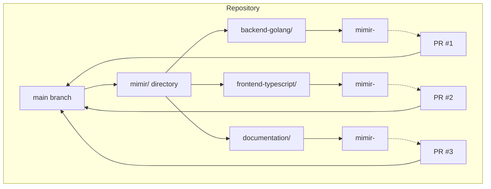
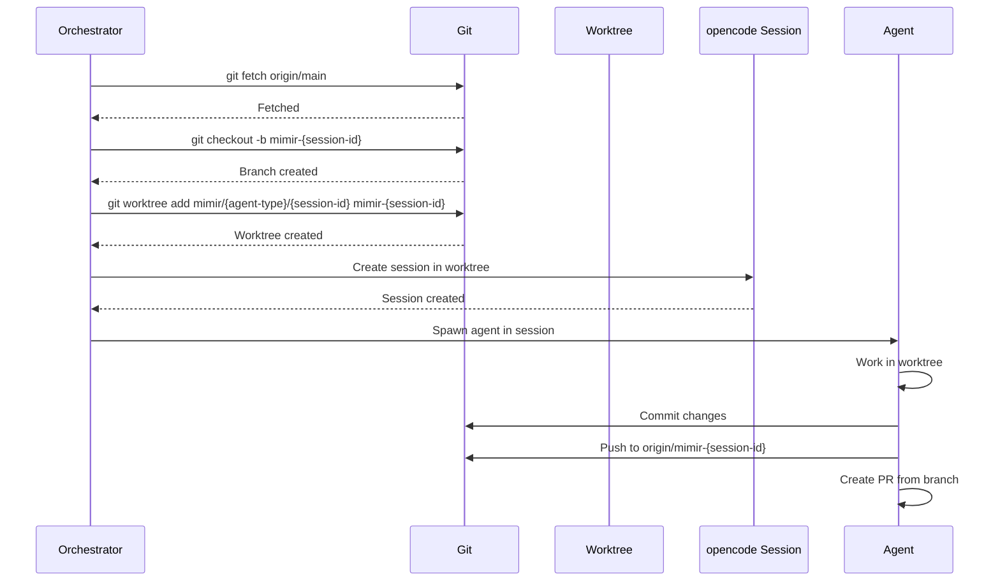
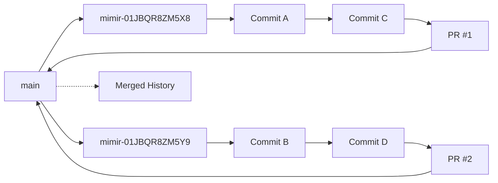
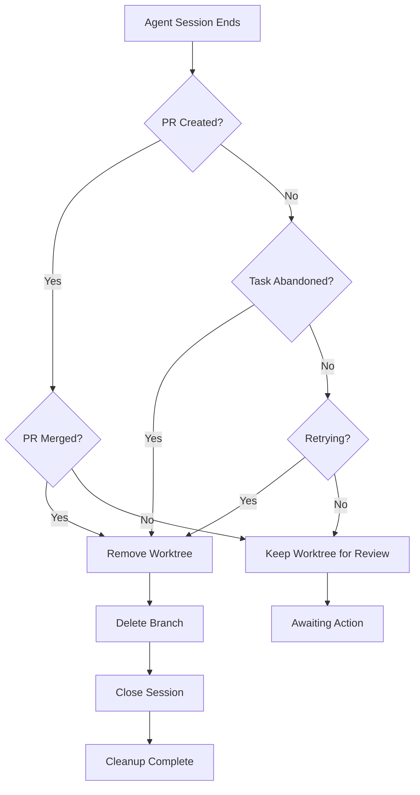

# Agent Isolation

Agent isolation ensures multiple agents can work on the same codebase without conflicts. Each agent session works in its own git worktree on a feature branch, providing complete isolation until changes are merged via PR review.

## Overview

Agent isolation provides:
- **Git worktree creation**: Each agent gets its own worktree
- **Feature branches**: Agents work on separate branches
- **No file conflicts**: Concurrent agents don't conflict
- **Independent history**: Each session has isolated git history
- **Cleanup on completion**: Worktrees removed after task completion

## Worktree Architecture



## Worktree Structure

### Directory Layout

```
repo/
├── .git/
├── src/
├── docs/
├── mimir/
│   ├── backend-golang/
│   │   ├── 01JBQR8ZM5X8YPQW6K3E5V2N9J/
│   │   └── 01JBQR8ZM5Y9AB4CD3EF6GH7I/
│   ├── frontend-typescript/
│   │   └── 01JBQR8ZM5Z0JK1LM2NO3PQ4R/
│   └── documentation/
│       └── 01JBQR8ZM60RS5TU6VW7XY8Z9/
├── .opencode/
│   └── agent/
└── package.json
```

### Naming Convention

- **Worktree path**: `mimir/{agent-type}/{session-id}`
- **Branch name**: `mimir-{session-id}`
- **Example**:
  - Agent type: `backend-golang`
  - Session ID: `01JBQR8ZM5X8YPQW6K3E5V2N9J`
  - Worktree: `mimir/backend-golang/01JBQR8ZM5X8YPQW6K3E5V2N9J`
  - Branch: `mimir-01JBQR8ZM5X8YPQW6K3E5V2N9J`

## Worktree Creation Flow



### Creation Steps

1. **Fetch latest**: Ensure main branch is up to date
2. **Create branch**: Create feature branch from main
3. **Create worktree**: Add worktree for the branch
4. **Initialize session**: Create opencode session in worktree
5. **Spawn agent**: Agent works in isolated environment
6. **Commit and push**: Agent commits changes to branch
7. **Create PR**: PR created from branch to main

## Isolation Guarantees

### File-Level Isolation

Each agent sees:
- **Only its own files**: Files in its worktree
- **Independent changes**: Changes don't affect other agents
- **No conflicts**: Concurrent edits to same file happen on different branches

### Git History Isolation



### Session Isolation

Each opencode session:
- **Unique session ID**: Separate from all other sessions
- **Separate context**: Independent conversation history
- **Separate todos**: Session-specific todos
- **Separate state**: Agent state not shared

## Concurrent Agent Execution

### Multi-Agent Scenario

Three agents working simultaneously on same repository:

```mermaid
gantt
    title Concurrent Agent Execution Timeline
    dateFormat  HH:mm
    axisFormat %H:%M

    section Agent 1 (Go)
    Create worktree       :a1, 09:00, 5m
    Analyze code          :a2, after a1, 10m
    Fix bug               :a3, after a2, 15m
    Create PR             :a4, after a3, 5m

    section Agent 2 (TS Frontend)
    Create worktree       :b1, 09:02, 5m
    Update UI             :b2, after b1, 12m
    Create PR             :b3, after b2, 5m

    section Agent 3 (Documentation)
    Create worktree       :c1, 09:05, 5m
    Write docs            :c2, after c1, 8m
    Create PR             :c3, after c2, 5m
```



### Conflict Avoidance

Since each agent works in its own branch:
- **File conflicts only on merge**: Conflicts appear during PR merge
- **No runtime conflicts**: Agents never edit each other's files
- **Independent commits**: Each agent commits to its own branch
- **Separate PRs**: Each agent creates its own PR

## Worktree Cleanup

### Cleanup Triggers

Worktrees are cleaned up when:
- **Task completed successfully**
- **PR merged to main**
- **PR rejected and abandoned**
- **Session terminated due to error**
- **Manual cleanup requested**

### Cleanup Flow



### Cleanup Steps

When cleaning up a worktree:

```bash
# 1. Remove worktree
git worktree remove mimir/{agent-type}/{session-id}

# 2. Delete branch (after PR merge or abandonment)
git branch -D mimir-{session-id}

# 3. Delete remote branch (if PR was created but not merged)
git push origin --delete mimir-{session-id}

# 4. Close opencode session
# (via SDK: client.session.delete(sessionId))
```

### Cleanup Safety

To prevent accidental data loss:
- **Never delete main branch**
- **Only delete branches after PR merge or explicit abandonment**
- **Keep worktrees if PR is still open for review**
- **Log all cleanup actions**
- **Confirm deletion of branches with PRs**

## Worktree Management

### Listing Worktrees

```bash
# List all worktrees
git worktree list

# List mimir worktrees only
git worktree list | grep mimir

# Output example:
# /path/to/repo                abc123 [main]
# /path/to/repo/mimir/backend-golang/01JBQR8ZM5X8YPQW6K3E5V2N9J  def456 [mimir-01JBQR8ZM5X8YPQW6K3E5V2N9J]
# /path/to/repo/mimir/frontend-typescript/01JBQR8ZM5Y9AB4CD3EF6GH7I  ghi789 [mimir-01JBQR8ZM5Y9AB4CD3EF6GH7I]
```

### Pruning Worktrees

```bash
# Remove worktrees where branches have been deleted
git worktree prune

# Remove stale worktrees manually
rm -rf mimir/{agent-type}/{session-id}
```

### Moving Worktrees

If worktree location changes:

```bash
# Move worktree to new location
git worktree move mimir/old/path mimir/new/path
```

## Error Handling

### Worktree Creation Failures

| Error | Cause | Handling |
|-------|-------|----------|
| Worktree already exists | Previous session not cleaned up | Use existing worktree or force remove first |
| Branch already exists | Previous session not cleaned up | Force delete branch or use existing |
| Insufficient disk space | No room for worktree | Use cleanup to free space, or use fallback location |
| Permission denied | Can't create directory | Log error, create issue for manual intervention |

### Cleanup Failures

| Error | Cause | Handling |
|-------|-------|----------|
| Worktree in use | Agent session still active | Terminate session first |
| Branch not merged | Trying to delete branch with open PR | Keep worktree, log warning |
| Permission denied | Can't remove directory | Log error, create issue for manual cleanup |
| Git lock file | Git operation in progress | Wait, retry, or force remove |

## Configuration

### Worktree Location

Default worktree location: `mimir/` in repository root

Can be configured via:

```yaml
# ~/.mimir/config.yaml
worktree:
  base_path: mimir
  fallback_path: /tmp/mimir-worktrees
  keep_after_merge: false
  prune_on_startup: true
```

### Cleanup Policy

```yaml
cleanup:
  merge_behavior: auto  # auto, manual, keep
  abandonment_timeout: 24h
  prune_interval: 1h
  keep_review_duration: 7d
```

## Best Practices

### Worktree Management

1. **Always create from main**: Ensure worktrees are based on clean main branch
2. **Use unique session IDs**: Prevent naming conflicts
3. **Clean up promptly**: Remove worktrees after task completion
4. **Monitor disk space**: Worktrees can consume significant space
5. **Log all actions**: Track creation and cleanup for debugging

### Agent Development

1. **Don't assume worktree location**: Use session-provided path
2. **Commit frequently**: Save progress with regular commits
3. **Push to remote**: Ensure changes are backed up remotely
4. **Create PRs for review**: Don't merge directly to main
5. **Handle conflicts**: Be prepared to resolve merge conflicts

### Troubleshooting

1. **Stale worktrees**: Use `git worktree prune` to clean up
2. **Missing worktrees**: Check filesystem permissions
3. **Branch conflicts**: Use unique session IDs
4. **Disk space**: Monitor and clean up old worktrees
5. **Git lock files**: Remove lock files if git is not running

## Next Steps

- [GitHub Integration](./agents-github-integration.md) - Learn how PRs are created and managed
- [Agent Development](./agents-development.md) - Understand how agents work with worktrees
- [Examples](./agents-examples/) - See isolation in action
