# Agent Orchestration

The Mimir orchestrator is the central coordinator that manages multi-agent workflows, creates and manages opencode sessions, routes events, handles agent lifecycles, and coordinates handoffs between agents.

## Overview

The Mimir orchestrator agent is responsible for:

- **Workflow Definition**: Define and execute multi-step workflows
- **Agent Management**: Spawn, monitor, and terminate worker agents
- **Event Routing**: Route events (Sentry, webhooks, cron) to appropriate agents
- **Session Management**: Create and manage opencode sessions for workers
- **Handoff Coordination**: Coordinate handoffs between agents
- **Progress Tracking**: Track task progress via GitHub issues
- **Failure Handling**: Handle failures and implement retry logic

## Orchestrator Architecture

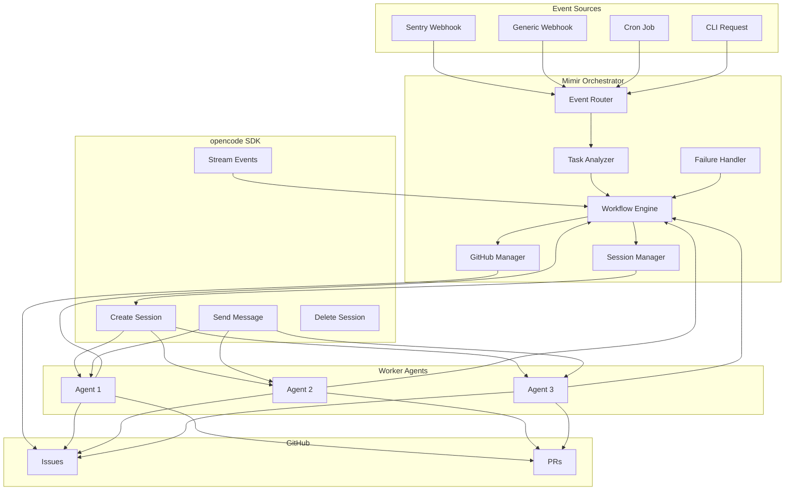

## Session Management

### Creating opencode Sessions

The orchestrator uses the opencode SDK to create sessions for worker agents:

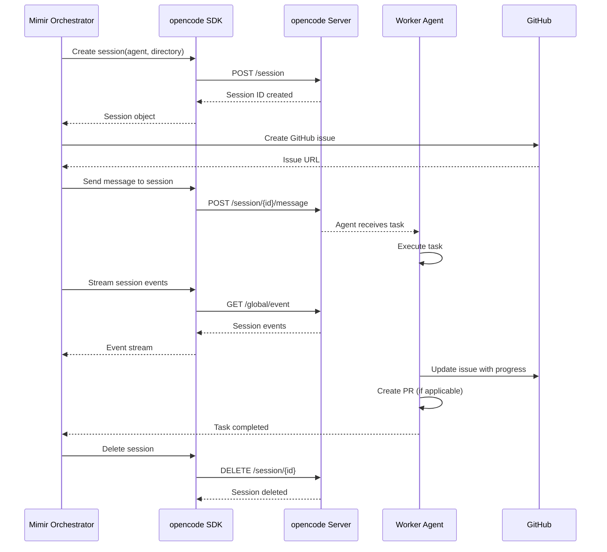

### Session Lifecycle

Each worker agent session follows this lifecycle:

1. **Task Received**: Orchestrator receives task from event/router
2. **GitHub Issue Created**: Issue created to track work
3. **Session Created**: opencode session created for worker agent
4. **Worktree Created**: Git worktree created for isolation
5. **Agent Executed**: Worker agent executes task in worktree
6. **Progress Updated**: Agent updates GitHub issue with progress
7. **PR Created** (if applicable): Agent creates PR for review
8. **Session Completed**: Agent finishes task
9. **Issue Closed**: GitHub issue closed on completion
10. **Cleanup**: Worktree removed and session deleted

### Session Isolation

Each session is isolated:
- **Unique session ID**: opencode generates unique session ID
- **Separate worktree**: Each session gets its own git worktree
- **Feature branch**: Agent works on `mimir-{session-id}` branch
- **Independent history**: No conflicts with other concurrent sessions
- **Separate context**: Each session has its own conversation history

## Event Routing

### Event Sources

The orchestrator handles events from multiple sources:

| Source | Trigger | Handler |
|--------|---------|---------|
| Sentry | Sentry webhook | Sentry triage workflow |
| Webhook | Generic webhook | Configured workflow |
| Cron | Scheduled job | Configured task |
| CLI | User command | Direct task execution |

### Event Routing Flow

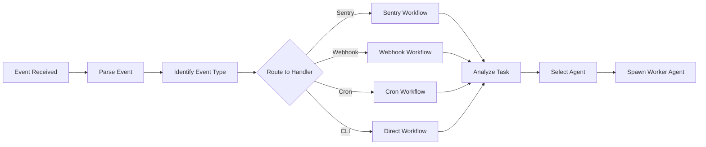

### Event Handler Pattern

Each event handler follows the same pattern:

1. **Parse**: Parse event payload
2. **Validate**: Validate event structure
3. **Extract**: Extract task requirements
4. **Route**: Route to appropriate workflow
5. **Execute**: Execute workflow steps
6. **Track**: Track progress via GitHub issues

## Workflow Management

### Workflow Definition

The orchestrator defines workflows as sequences of agent tasks:

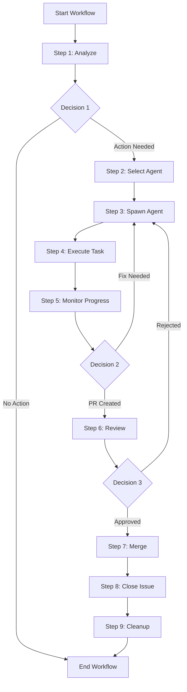

### Sentry Workflow Example

1. **Sentry event received**
2. **Mimir orchestrator creates GitHub issue**
3. **Spawn Sentry triage agent**
4. **Triage agent analyzes event**
5. **If action needed:**
   - Spawn appropriate language agent
   - Language agent creates worktree
   - Language agent fixes bug
   - Language agent creates PR
   - Update GitHub issue
6. **If PR merged:**
   - Close GitHub issue
   - Remove worktree
   - Terminate sessions

### Workflow Patterns

#### Sequential Workflow

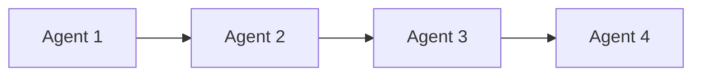

**Use case**: Linear progression through analysis, fix, review, merge.

#### Parallel Workflow

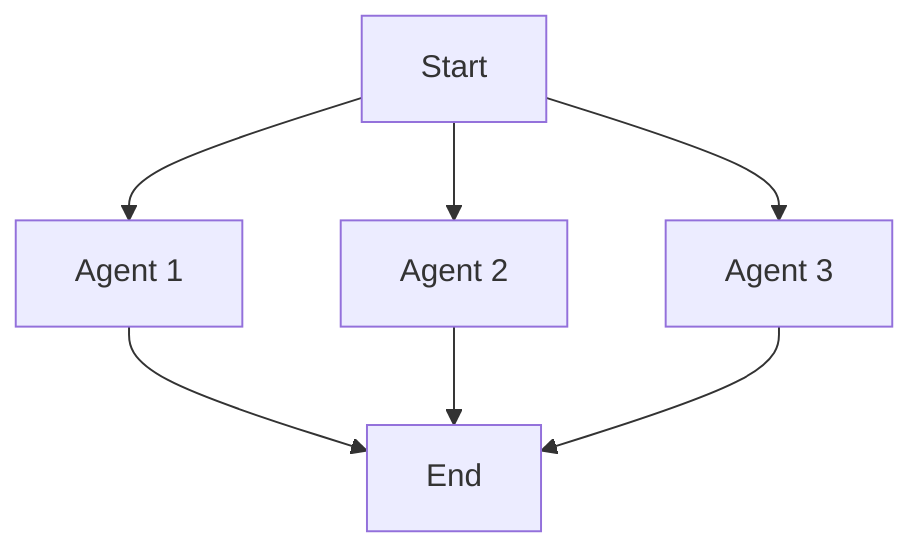

**Use case**: Multiple agents working on independent tasks simultaneously.

#### Conditional Workflow

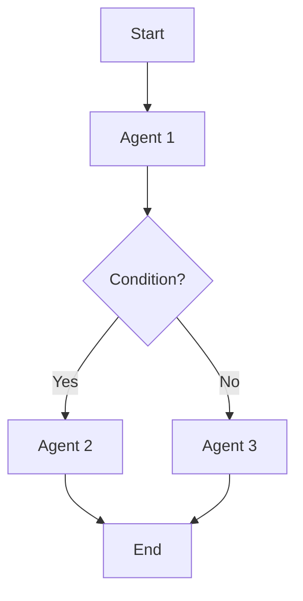

**Use case**: Agent routing based on analysis results.

#### Looping Workflow

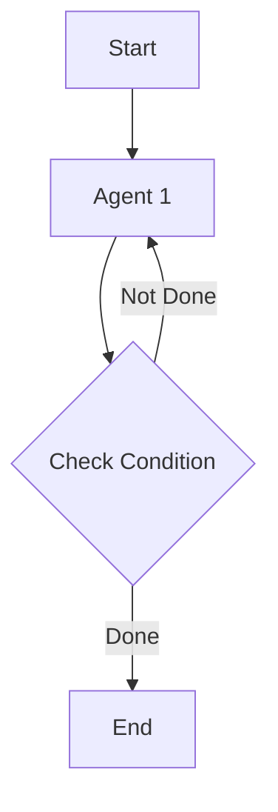

**Use case**: Agent iterates until task complete (e.g., test-fix loop).

## Agent Handoff

### Handoff Mechanism

Agents communicate through the orchestrator, not directly:

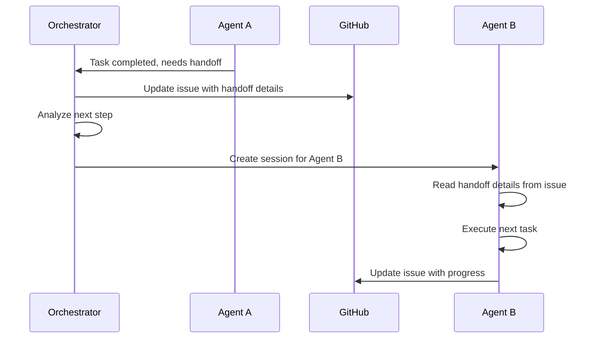

### Handoff Data

Handoff data is communicated via GitHub issue comments:

```
---
**Handoff from Sentry Triage Agent**

**Analysis**: Sentry event ID 1234567890 indicates null pointer exception in /src/auth/login.go
**Severity**: High
**Recommended Action**: Fix null pointer in authentication module
**Agent Requested**: backend-golang
**Context**: User login failing on production
---
```

### Handoff States

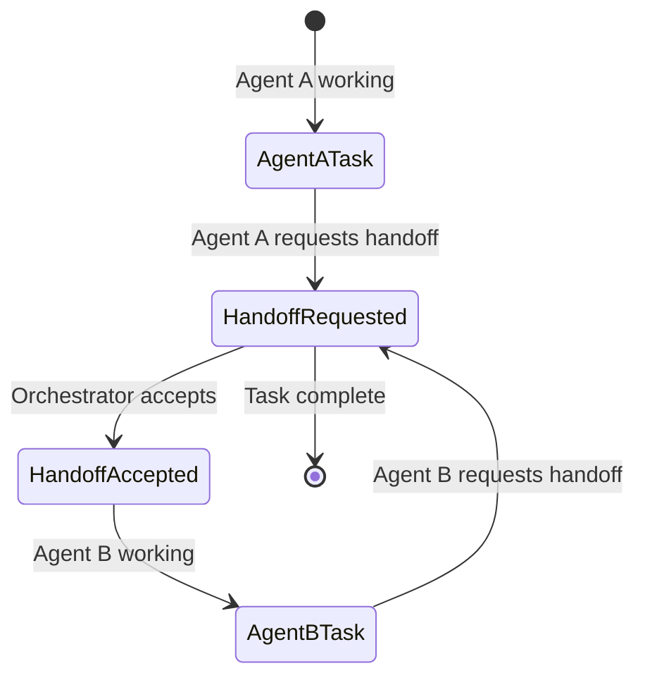

## Failure Handling

### Failure Scenarios

| Scenario | Handling Strategy |
|----------|------------------|
| Agent fails to start | Retry up to 3 times, then escalate |
| Agent execution timeout | Terminate session, log error, create issue |
| Agent produces invalid output | Restart agent with corrected instructions |
| Worktree creation fails | Use fallback directory, log error |
| GitHub API failure | Retry with exponential backoff |
| PR rejected by maintainer | Agent iterates on feedback |
| Session cleanup fails | Log error, manual cleanup required |

### Retry Logic

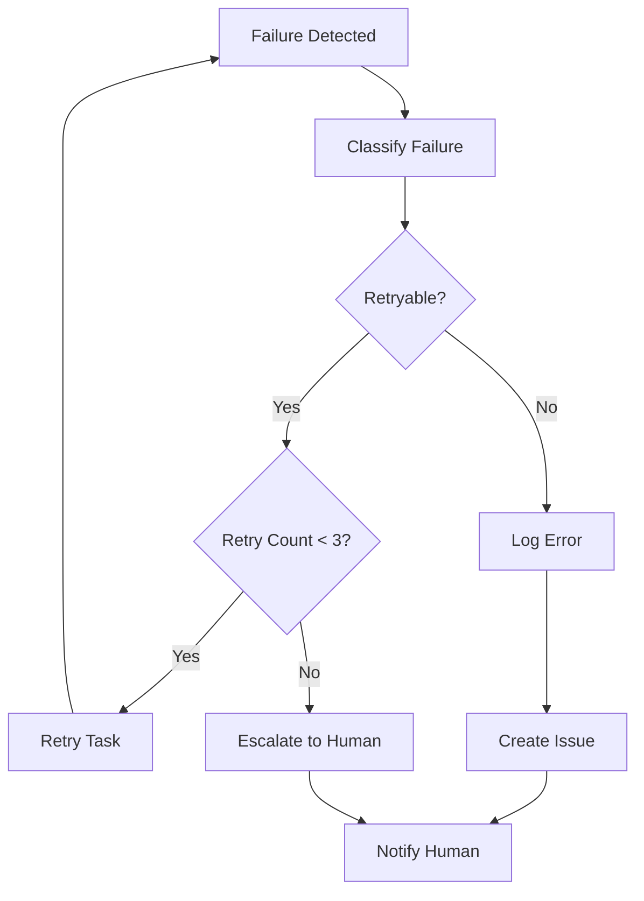

## GitHub Integration

### Issue Creation

Every task creates a GitHub issue:

```yaml
Title: [Mimir] Fix null pointer in authentication module
Labels:
  - mimir
  - mimir-agent-backend-golang
  - mimir-task-abc123
  - in-progress
Body:
  ## Task Details
  - **Agent**: backend-golang
  - **Session ID**: 01JBQR8ZM5X8YPQW6K3E5V2N9J
  - **Worktree**: mimir/backend-golang/01JBQR8ZM5X8YPQW6K3E5V2N9J
  - **Branch**: mimir-01JBQR8ZM5X8YPQW6K3E5V2N9J

  ## Progress
  - [ ] Create worktree
  - [ ] Analyze code
  - [ ] Implement fix
  - [ ] Run tests
  - [ ] Create PR

  ## Handoff
  From Sentry Triage Agent
```

### Issue Updates

Agents update issues with progress:

```
**Progress Update**

- ✅ Created worktree
- ✅ Analyzed code at /src/auth/login.go:142
- ✅ Implemented null pointer fix
- 🔄 Running tests...
```

## Tools Available to Orchestrator

The Mimir orchestrator has access to these tools:

- **opencode SDK**: Create, monitor, and manage opencode sessions
- **GitHub plugin**: Create, update, and close GitHub issues; manage PRs
- **Sentry plugin**: Analyze Sentry events; fetch issue details
- **Git tools**: Manage worktrees; create branches; merge PRs
- **Configuration tools**: Access agent registry; load project configs

## Monitoring and Observability

### Session Monitoring

The orchestrator streams events from all active sessions:

```typescript
const eventStream = client.global.event.get({
  query: { event: ["session.updated", "session.error", "message.created"] }
})

for await (const event of eventStream) {
  // Track agent progress
  // Handle errors
  // Update GitHub issues
}
```

### Key Metrics

- **Active Sessions**: Number of concurrent agent sessions
- **Session Duration**: Time per session
- **Task Completion Rate**: Percentage of completed tasks
- **PR Merge Rate**: Percentage of merged PRs
- **Error Rate**: Percentage of failed sessions

## Next Steps

- [Agent Discovery](./agents-discovery.md) - Learn how the orchestrator selects appropriate agents
- [Agent Workflows](./agents-workflow.md) - Explore workflow patterns and examples
- [Examples](./agents-examples/) - See complete workflow implementations
