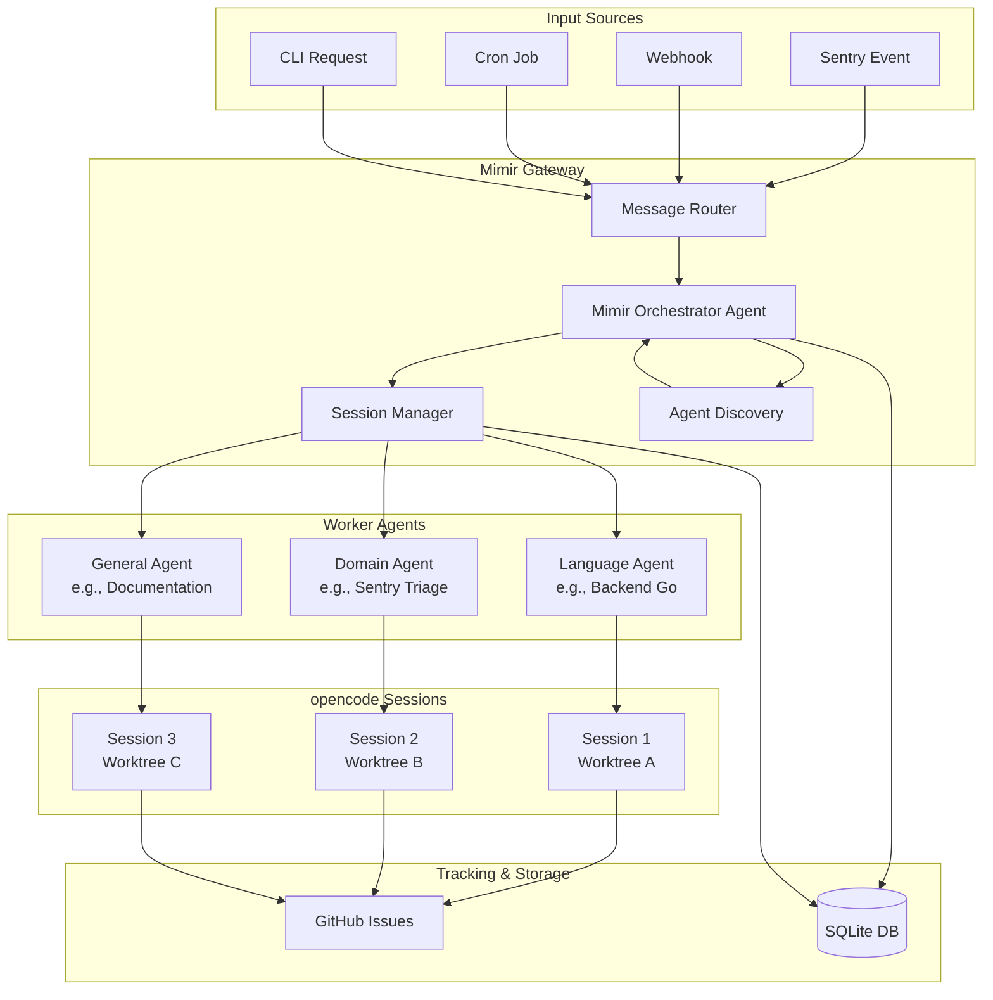
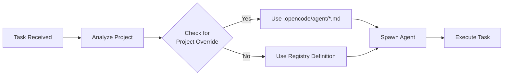
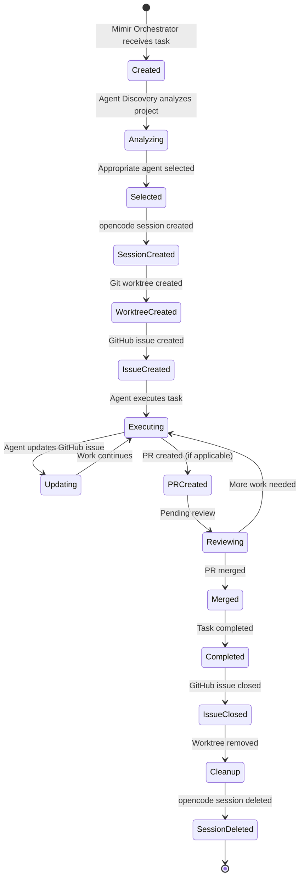

# Agents Overview

The AGENTS system in Mimir provides intelligent orchestration of multiple opencode instances for autonomous software development. This document covers the high-level architecture, design principles, and how agents work together to complete complex tasks.

## What Are Agents?

Agents in Mimir are specialized workers that can:
- Execute specific tasks based on their expertise
- Trigger other agents when needed
- Work in isolated git worktrees to avoid conflicts
- Track progress via GitHub issues
- Communicate through the Mimir orchestrator

### Agent Characteristics

- **Ephemeral**: Created for specific tasks, not long-lived
- **Specialized**: Each agent has expertise in a language, stack, or domain
- **Isolated**: Each agent session works in a separate git worktree
- **Coordinated**: Orchestrated by the Mimir agent for complex workflows
- **Trackable**: All work tracked via GitHub issues for monitoring

## Agent Types

### Orchestrator Agents

**Mimir Orchestrator** - The central coordinator that:
- Manages multi-agent workflows
- Routes events (Sentry, webhooks, cron) to appropriate workers
- Creates and manages opencode sessions
- Handles agent lifecycles and handoffs
- Tracks task progress via GitHub issues

### Worker Agents (By Language/Stack)

| Agent | Expertise | When Used |
|-------|-----------|----------|
| `backend-golang` | Go backend development | Go projects, API servers, microservices |
| `backend-python` | Python backend development | Python projects, Django/Flask apps, data processing |
| `backend-typescript` | TypeScript/Node backend | Node.js projects, Express/NestJS APIs |
| `frontend-typescript` | React/TypeScript frontend | React apps, Next.js, TypeScript UIs |
| `backend-rust` | Rust backend development | Rust projects, high-performance services |

### General Purpose Agents

| Agent | Expertise | When Used |
|-------|-----------|----------|
| `documentation` | Documentation generation and maintenance | API docs, README updates, code comments |
| `research` | Research and analysis | Technology research, best practices, architecture analysis |
| `code-review` | Code review and quality analysis | PR reviews, security audits, best practices |

### Domain-Specific Agents

| Agent | Expertise | When Used |
|-------|-----------|----------|
| `sentry-triage` | Sentry event analysis and triage | Analyzing Sentry errors, determining action needed |

## Architecture Overview



## Hybrid Agent Approach

Mimir uses a hybrid approach for agent definitions:

### Centralized Agent Registry

Location: `/docs/agents-examples/registry/`

Contains production-ready agent definitions that:
- Follow opencode's `.opencode/agent/*.md` format
- Are 100% compatible with opencode
- Can be copied into any project

### Project-Specific Overrides

Location: Project's `.opencode/agent/*.md`

Allows:
- Customizing agent behavior for specific projects
- Adding project-specific instructions
- Overriding default permissions or models

### How It Works



## Agent Lifecycle



## Key Design Principles

### 1. 100% opencode Compatibility

All agent definitions follow opencode's structure:
- Markdown files with YAML frontmatter
- Compatible with opencode's agent system
- Can be used directly in `.opencode/agent/*.md`

### 2. Dynamic Agent Discovery

Agents are selected based on:
- Project type (Go, Python, TypeScript, Rust)
- Repository structure and files
- Task requirements and complexity
- Configuration overrides

### 3. Isolation via Git Worktrees

Each agent session:
- Gets its own git worktree: `mimir/{agent-type}/{session-id}`
- Works on a feature branch: `mimir-{session-id}`
- Avoids conflicts with other concurrent agents
- Changes are isolated until PR review

### 4. GitHub Issue Tracking

Every task:
- Creates a dedicated GitHub issue
- Updates issue with progress via comments
- Links to PR when created
- Closes issue on completion
- Enables multiplayer collaboration and monitoring

### 5. Orchestrated Workflows

The Mimir orchestrator:
- Defines and executes multi-step workflows
- Coordinates handoffs between agents
- Manages agent lifecycles
- Handles failures and retries
- Routes events to appropriate agents

## Agent Capabilities

### What Agents Can Do

- **Read and analyze code**: Use opencode's read and search tools
- **Execute commands**: Run build, test, deployment commands (with permissions)
- **Create and edit files**: Write code, documentation, configs
- **Create PRs**: Submit changes for review via GitHub
- **Track work**: Update GitHub issues with progress
- **Trigger other agents**: Request help from specialized agents
- **Use plugins**: Access tools from plugins (Sentry, GitHub, etc.)

### What Agents Cannot Do

- **Direct cross-agent communication**: All communication via orchestrator
- **Edit main branch directly**: Always work in worktree branches
- **Access external directories**: Blocked by permission system
- **Execute destructive commands**: Protected by permission checks

## opencode Integration

### opencode Concepts Mapping

| Mimir Concept | opencode Concept | Notes |
|--------------|-----------------|-------|
| Agent Definition | `.opencode/agent/*.md` | 100% compatible |
| Agent Session | opencode Session | Mimir creates via SDK |
| Agent Permissions | Agent `permission` config | File access, bash, tools |
| Agent Tools | opencode Tools + Plugins | Plugins add tools |
| Agent Events | opencode Events + SDK | Event stream coordination |
| Agent Config | opencode JSON config | Provider, model, permissions |

### opencode SDK Usage

The Mimir orchestrator uses the opencode SDK to:

```typescript
// Create session for worker agent
const session = await client.session.create({
  body: {
    agent: "backend-golang",
    directory: worktreePath
  }
})

// Stream events to monitor agent
const eventStream = client.global.event.get({
  query: { session: [session.id] }
})

for await (const event of eventStream) {
  // Track agent progress, handle events
}

// Send messages to agent
await client.session.message.create(session.id, {
  body: {
    parts: [{ type: "text", text: "Fix the bug" }]
  }
})

// Clean up session
await client.session.delete(session.id)
```

## Use Cases

### Sentry Issue Resolution

1. Sentry webhook received
2. Mimir orchestrator analyzes event
3. Spawns Sentry triage agent
4. Triage agent determines if action needed
5. If needed, spawns appropriate language agent
6. Language agent fixes bug in worktree
7. Creates PR for review
8. Updates GitHub issue with progress
9. Closes issue on merge

### Scheduled Code Review

1. Cron job triggers review task
2. Mimir orchestrator spawns code-review agent
3. Agent analyzes code in worktree
4. Creates GitHub issue with findings
5. Updates issue with detailed review
6. Closes issue on completion

### Multi-Project Task

1. Task spans multiple projects
2. Mimir orchestrator identifies each project's type
3. Spawns appropriate agents per project
4. Coordinates work across agents
5. Aggregates progress via GitHub issues
6. Completes when all agents finish

## Next Steps

- [Agent Orchestration](./agents-orchestration.md) - Learn how the Mimir orchestrator manages agent sessions
- [Agent Discovery](./agents-discovery.md) - Understand how agents are dynamically selected
- [Agent Workflows](./agents-workflow.md) - Explore multi-agent workflow patterns
- [Examples](./agents-examples/) - See complete workflow examples and agent definitions
