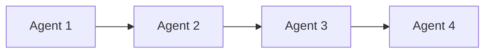
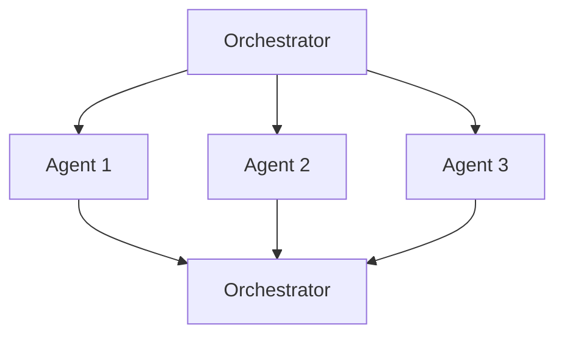
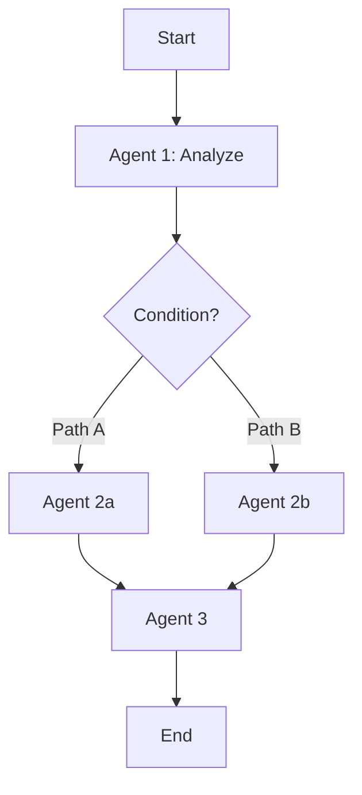
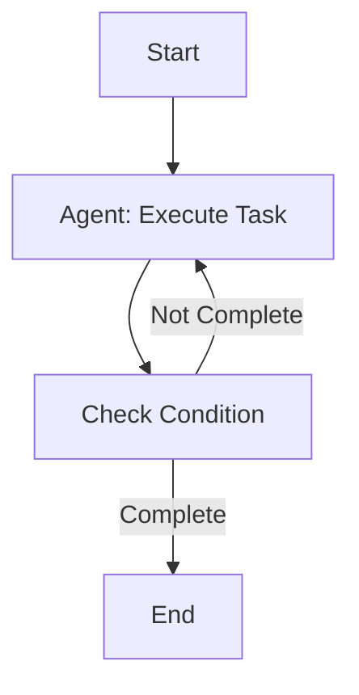
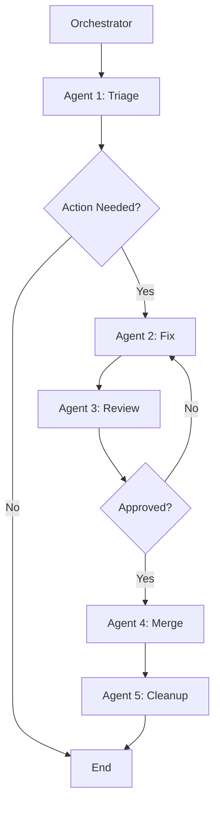
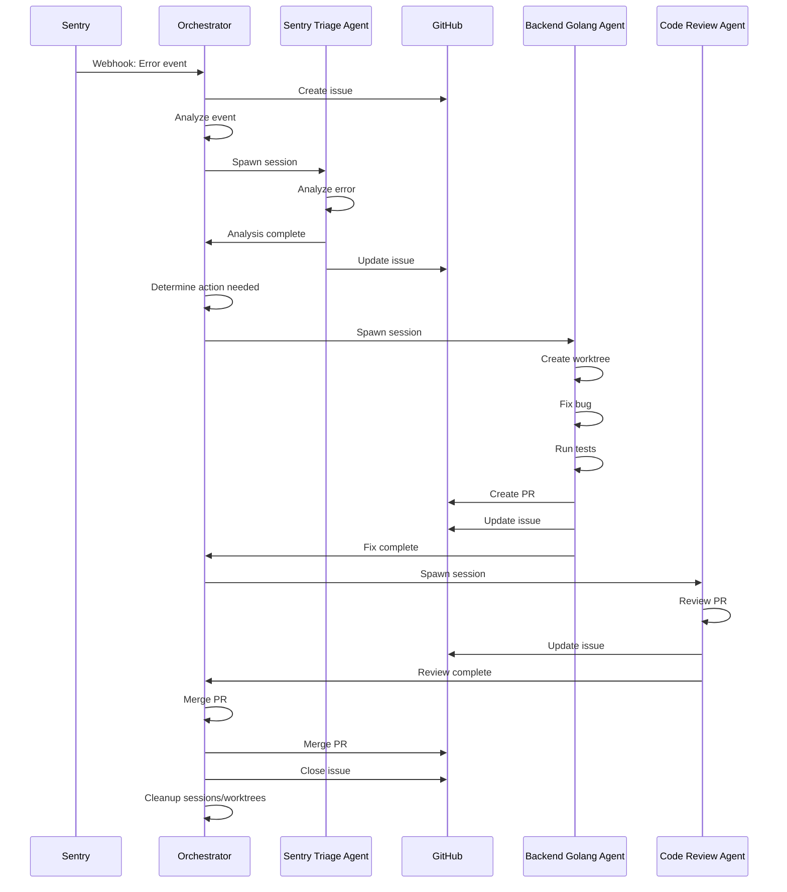
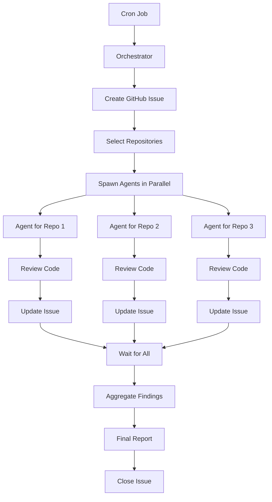
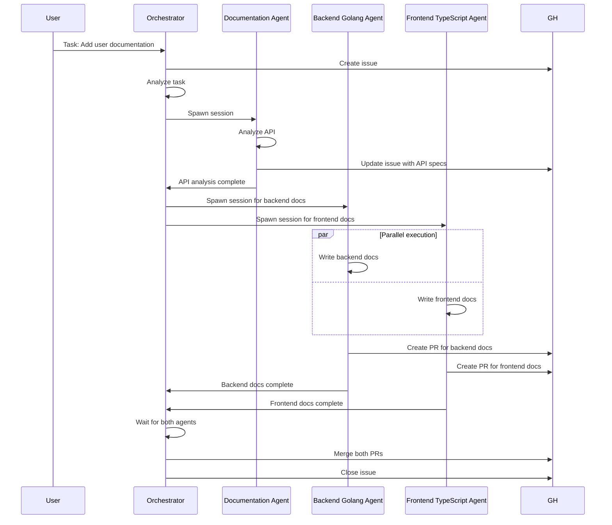
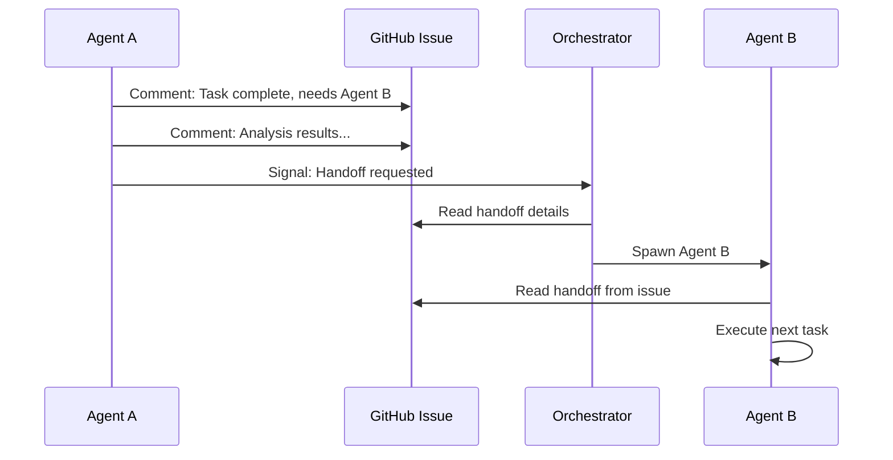
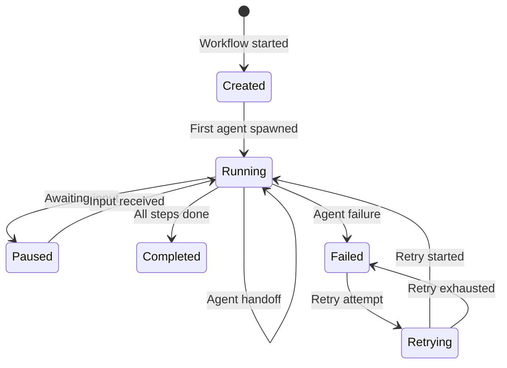

# Agent Workflows

Multi-agent workflows enable complex tasks to be completed by coordinating multiple specialized agents. The Mimir orchestrator defines and executes workflows that span multiple agents, handling handoffs, dependencies, and error recovery.

## Overview

Agent workflows:
- Define sequences of agent tasks
- Coordinate handoffs between agents
- Handle parallel and sequential execution
- Manage dependencies and conditions
- Track progress via GitHub issues
- Support looping and branching patterns

## Workflow Patterns

### Sequential Workflow

Agents execute one after another, with each passing results to the next.



**Use Cases**:
- Code review → Fix → Re-review
- Analysis → Implementation → Testing
- Documentation → Review → Publish

**Example**: Sentry Issue Resolution
1. Sentry Triage Agent analyzes event
2. Backend Golang Agent fixes bug
3. Code Review Agent reviews changes
4. Orchestrator merges PR

### Parallel Workflow

Multiple agents execute simultaneously on independent tasks.



**Use Cases**:
- Multiple independent bug fixes
- Simultaneous code reviews
- Parallel documentation updates

**Example**: Multi-Project Fix
1. Orchestrator spawns 3 agents for different sub-projects
2. All agents work in parallel
3. Orchestrator waits for all to complete

### Conditional Workflow

Agent selection based on analysis results or conditions.



**Use Cases**:
- Sentry triage determines if action needed
- Code review determines fix complexity
- Task analysis determines required agents

**Example**: Sentry Triage
1. Sentry Triage Agent analyzes event
2. If critical → Spawn Backend Golang Agent immediately
3. If low severity → Wait for human approval first

### Looping Workflow

Agent iterates until a condition is met (e.g., test-fix loop).



**Use Cases**:
- Test-fix iteration until tests pass
- Code review iterations until approved
- Documentation refinement until complete

**Example**: Fix and Test Loop
1. Backend Golang Agent fixes bug
2. Run tests
3. If tests fail → Fix again
4. If tests pass → Create PR

### Hybrid Workflow

Combination of sequential, parallel, and conditional patterns.



**Use Cases**:
- Complex Sentry workflows
- Multi-step feature development
- Complete issue lifecycle

## Sentry Workflow Example

Complete end-to-end Sentry issue resolution workflow:



### Workflow Steps

| Step | Agent | Action | Output |
|------|-------|--------|--------|
| 1 | Orchestrator | Receive Sentry webhook | Event data |
| 2 | Orchestrator | Create GitHub issue | Issue #123 |
| 3 | Orchestrator | Spawn Sentry Triage Agent | Session created |
| 4 | Sentry Triage | Analyze error event | Analysis report |
| 5 | Sentry Triage | Update GitHub issue | Comment added |
| 6 | Orchestrator | Determine action needed | Decision: yes/no |
| 7 | Orchestrator | Spawn Backend Golang Agent | Session created |
| 8 | Backend Golang | Create git worktree | Worktree path |
| 9 | Backend Golang | Fix bug | Code changes |
| 10 | Backend Golang | Run tests | Test results |
| 11 | Backend Golang | Create PR | PR #456 |
| 12 | Backend Golang | Update GitHub issue | PR link added |
| 13 | Backend Golang | Complete task | Session done |
| 14 | Orchestrator | Spawn Code Review Agent | Session created |
| 15 | Code Review | Review PR | Review comments |
| 16 | Code Review | Update GitHub issue | Review added |
| 17 | Code Review | Complete task | Session done |
| 18 | Orchestrator | Merge PR | PR merged |
| 19 | Orchestrator | Close GitHub issue | Issue #123 closed |
| 20 | Orchestrator | Cleanup sessions/worktrees | Cleanup complete |

## Scheduled Code Review Workflow



## Multi-Agent Task Workflow

Task requiring coordination between multiple agents:



## Workflow Definition

### Workflow DSL (Conceptual)

Workflows are defined by the orchestrator using a simple DSL:

```yaml
name: sentry-resolution
description: Resolve Sentry issues automatically
steps:
  - name: triage
    agent: sentry-triage
    input:
      event: ${sentryEvent}
    output:
      analysis: ${triageAnalysis}
    condition:
      field: analysis.actionNeeded
      operator: equals
      value: true

  - name: fix
    agent: ${analysis.agentType}
    input:
      worktree: true
      task: ${analysis.task}
    output:
      pr: ${fixPR}

  - name: review
    agent: code-review
    input:
      pr: ${fixPR}
    condition:
      field: ${fixPR.status}
      operator: equals
      value: created

  - name: merge
    agent: orchestrator
    input:
      pr: ${fixPR}
      condition:
        field: review.approved
        operator: equals
        value: true
```

### Dynamic Workflow Generation

Workflows can be dynamically generated based on:
- Task analysis results
- Agent capabilities
- Project structure
- User configuration

## Handoff Mechanism

### Handoff via GitHub Issues

Agents communicate via GitHub issue comments:



### Handoff Data Structure

Handoff comments use a structured format:

```markdown
---
**Handoff from {Agent Name}**

**Task Completed**: {Description of completed task}
**Analysis**: {Key findings}
**Recommendation**: {What should happen next}
**Agent Requested**: {agent-name}
**Context**: {Relevant context, file paths, etc.}

**Artifacts**:
- PR: #{pr-number}
- Branch: mimir-{session-id}
- Files changed: {list of files}
---
```

## Workflow State Management

### State Tracking

The orchestrator tracks workflow state:



### State Storage

Workflow state is stored in:
- **GitHub Issue**: Progress comments
- **SQLite Database**: Workflow metadata
- **Session Storage**: Agent session data

## Error Handling in Workflows

### Error Recovery Strategies

| Error Type | Recovery Strategy |
|------------|-------------------|
| Agent spawn failure | Retry up to 3 times, then fail |
| Agent execution timeout | Terminate, log error, create issue |
| Handoff failure | Use fallback handoff method |
| PR rejected | Restart agent with feedback |
| Merge conflict | Agent resolves, retries merge |
| Worktree creation failure | Use fallback directory |

### Workflow Rollback

When workflow fails:
1. Terminate all active agent sessions
2. Create GitHub issue with error details
3. Clean up worktrees and branches
4. Preserve logs for debugging
5. Notify human for intervention

## Workflow Monitoring

### Progress Tracking

Monitor workflow progress via:
- **GitHub Issue**: Real-time progress updates
- **Event Stream**: Agent events via opencode SDK
- **Dashboard**: Workflow status dashboard (future)

### Key Metrics

- **Workflow Duration**: Total time to complete
- **Agent Utilization**: Agent session time vs. idle time
- **Success Rate**: Percentage of successful workflows
- **Average Handoffs**: Number of handoffs per workflow
- **Error Rate**: Percentage of failed workflows

## Best Practices

### Workflow Design

1. **Keep workflows simple**: Break complex tasks into smaller sub-workflows
2. **Define clear handoff points**: Explicit data passing between agents
3. **Handle all error cases**: Define recovery strategies
4. **Track everything**: Log all state changes and decisions
5. **Use conditional branching**: Avoid unnecessary agent spawns

### Handoff Design

1. **Use structured comments**: Follow handoff data structure format
2. **Include all context**: Pass relevant files, analysis, recommendations
3. **Be explicit**: Clearly state what agent is needed next
4. **Link artifacts**: Include PR links, branch names, file paths

### Error Handling

1. **Fail fast**: Detect errors early
2. **Retry intelligently**: Exponential backoff, max retries
3. **Preserve state**: Don't lose progress on failure
4. **Notify humans**: Create issues when automation fails

## Next Steps

- [Agent Isolation](./agents-isolation.md) - Learn how agents work in isolated worktrees
- [GitHub Integration](./agents-github-integration.md) - Understand issue-based tracking
- [Examples](./agents-examples/) - See complete workflow implementations
